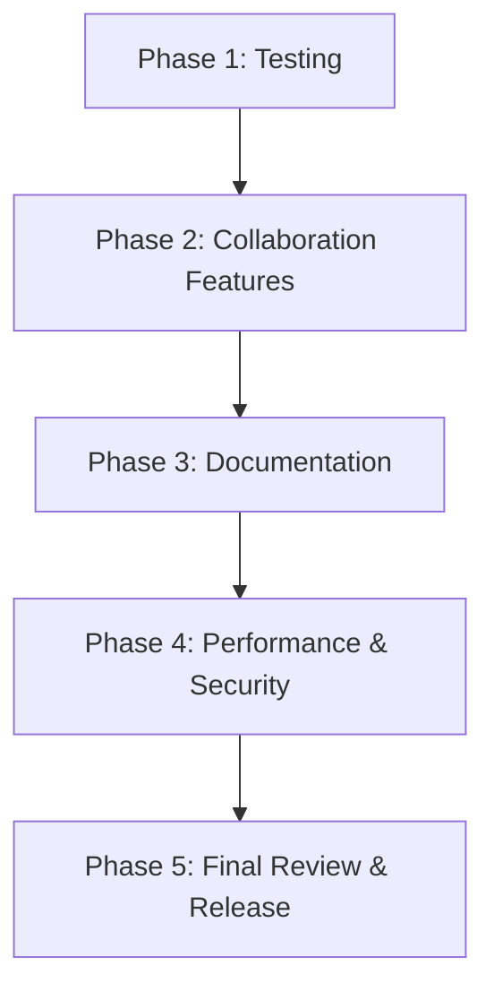
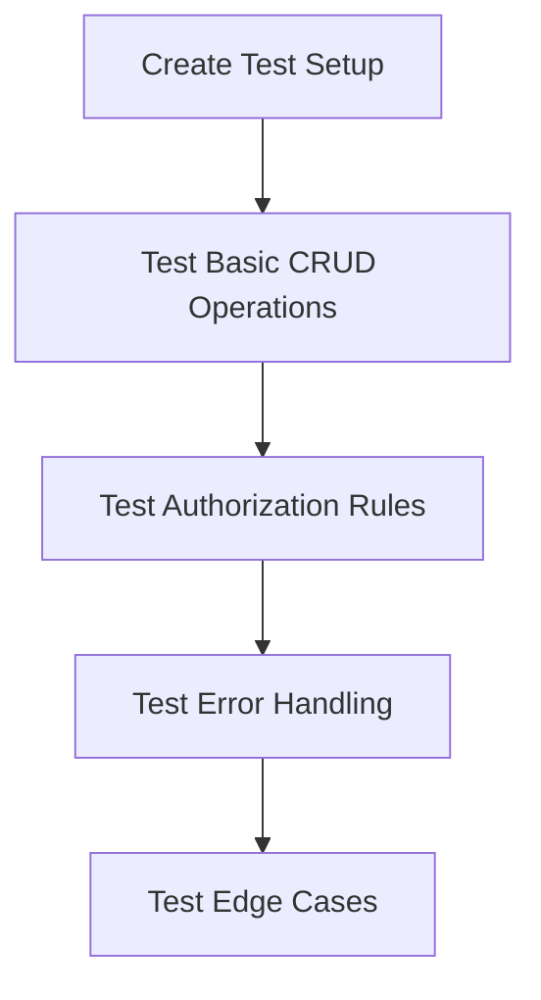
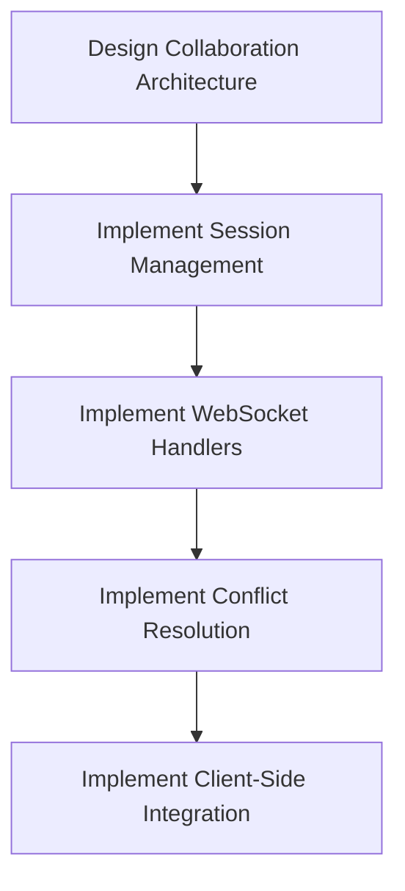
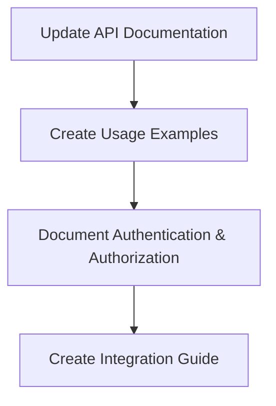
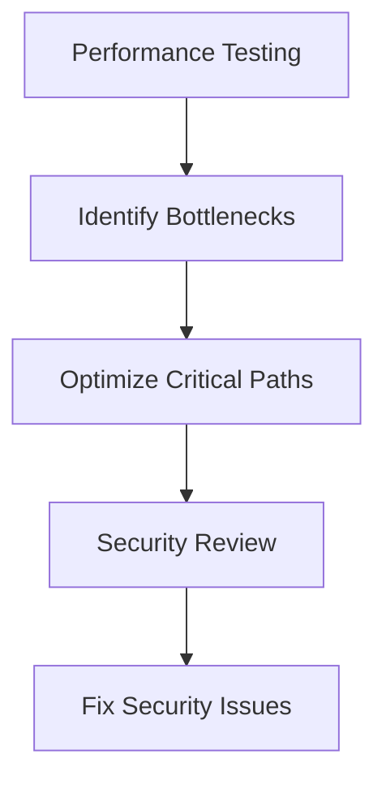
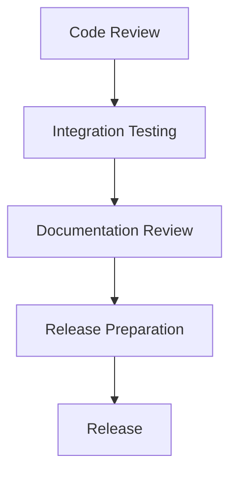

# API Implementation Next Steps

## Current Status Summary

The implementation has successfully completed:

- Phase 1: Update Gin Adapter
- Phase 2: Update Threat Model Handlers
- Phase 3: Implement Nested Diagram Handlers
- Phase 4: Create ThreatModelDiagramHandler
- Phase 5: Update Data Models and Relationships
- Phase 6: Update Handler Implementation for Schema Changes

The main gaps are:

1. Missing tests for ThreatModelDiagramHandler
2. Placeholder implementations for collaboration features
3. Lack of comprehensive documentation
4. No performance or security testing

## Implementation Plan

### Phase 1: Testing (Estimated time: 1-2 weeks)

#### 1.1 Create Test Suite for ThreatModelDiagramHandler

**Tasks:**

1. Create a new file `api/threat_model_diagram_handlers_test.go`
2. Implement test setup functions similar to those in `diagram_handlers_test.go`:

   - `setupThreatModelDiagramRouter()`
   - `setupThreatModelDiagramRouterWithUser(userName string)`
   - `createTestThreatModelWithDiagram(t *testing.T, router *gin.Engine, name string, description string)`

3. Implement tests for basic CRUD operations:

   - `TestGetThreatModelDiagrams`: Test listing diagrams within a threat model
   - `TestCreateThreatModelDiagram`: Test creating a diagram within a threat model
   - `TestGetThreatModelDiagramByID`: Test retrieving a specific diagram from a threat model
   - `TestUpdateThreatModelDiagram`: Test updating a diagram within a threat model
   - `TestPatchThreatModelDiagram`: Test partially updating a diagram within a threat model
   - `TestDeleteThreatModelDiagram`: Test deleting a diagram from a threat model

4. Implement tests for authorization rules:

   - `TestThreatModelDiagramReadWriteDeletePermissions`: Test access levels for different operations
   - `TestThreatModelDiagramWriterCanUpdateNonOwnerFields`: Test that writers can update non-owner fields

5. Implement tests for error handling:

   - `TestThreatModelDiagramNotFound`: Test behavior when a diagram is not found
   - `TestThreatModelNotFound`: Test behavior when a threat model is not found
   - `TestInvalidThreatModelDiagramInput`: Test behavior with invalid input

6. Implement tests for edge cases:
   - `TestDiagramNotInThreatModel`: Test behavior when a diagram ID is valid but not associated with the threat model
   - `TestThreatModelDiagramWithoutGraphData`: Test behavior with a diagram that has no graph data

#### 1.2 Create Tests for Collaboration Endpoints

**Tasks:**

1. Implement tests for collaboration endpoints:

   - `TestGetThreatModelDiagramCollaborate`: Test retrieving collaboration session status
   - `TestPostThreatModelDiagramCollaborate`: Test joining/starting a collaboration session
   - `TestDeleteThreatModelDiagramCollaborate`: Test leaving a collaboration session

2. Test collaboration with different user roles:
   - `TestThreatModelDiagramCollaborationPermissions`: Test that readers can join but not start sessions, writers can start and join sessions

### Phase 2: Collaboration Features (Estimated time: 2-3 weeks)

**Tasks:**

1. Design collaboration architecture:

   - Define collaboration session data structure
   - Define WebSocket message formats
   - Design conflict resolution strategy

2. Implement session management:

   - Update `GetThreatModelDiagramCollaborate` to return actual session information
   - Update `PostThreatModelDiagramCollaborate` to create or join a session
   - Update `DeleteThreatModelDiagramCollaborate` to leave a session

3. Implement WebSocket handlers:

   - Create a WebSocket handler for diagram collaboration
   - Implement message broadcasting to all session participants
   - Implement user presence notifications

4. Implement conflict resolution:

   - Implement operational transformation or similar algorithm
   - Handle concurrent edits to the same diagram
   - Ensure consistency across all clients

5. Implement client-side integration:
   - Create example client code for connecting to collaboration sessions
   - Document WebSocket API for client developers

### Phase 3: Documentation (Estimated time: 1 week)

**Tasks:**

1. Update API documentation:

   - Document all endpoints with request/response examples
   - Update OpenAPI specification if needed
   - Document error responses

2. Create usage examples:

   - Example of creating a threat model and adding diagrams
   - Example of collaborating on a diagram
   - Example of managing authorization

3. Document authentication and authorization:

   - Explain how authentication works
   - Document authorization rules for different endpoints
   - Provide examples of working with different user roles

4. Create integration guide:
   - Guide for integrating with the API
   - Best practices for error handling
   - Performance considerations

### Phase 4: Performance & Security (Estimated time: 1-2 weeks)

**Tasks:**

1. Performance testing:

   - Test with large threat models containing many diagrams
   - Test collaboration with multiple concurrent users
   - Measure response times and resource usage

2. Identify bottlenecks:

   - Analyze performance test results
   - Identify slow endpoints or operations
   - Determine resource constraints

3. Optimize critical paths:

   - Implement caching where appropriate
   - Optimize database queries
   - Improve concurrency handling

4. Security review:

   - Review authentication and authorization implementation
   - Check for common vulnerabilities (OWASP Top 10)
   - Ensure proper input validation and output sanitization

5. Fix security issues:
   - Address any identified vulnerabilities
   - Implement additional security measures if needed
   - Document security considerations for API users

### Phase 5: Final Review & Release (Estimated time: 1 week)

**Tasks:**

1. Code review:

   - Review all implemented code
   - Ensure code quality and consistency
   - Address any technical debt

2. Integration testing:

   - Test the API as a whole
   - Verify that all endpoints work together correctly
   - Test with realistic scenarios

3. Documentation review:

   - Review all documentation
   - Ensure accuracy and completeness
   - Address any gaps or inconsistencies

4. Release preparation:

   - Create release notes
   - Update version numbers
   - Prepare deployment plan

5. Release:
   - Deploy the API
   - Monitor for issues
   - Provide support for initial users

## Prioritization

1. **High Priority**:

   - Creating tests for ThreatModelDiagramHandler
   - Implementing real collaboration features
   - Fixing any security issues

2. **Medium Priority**:

   - Updating API documentation
   - Performance testing and optimization
   - Integration testing

3. **Lower Priority**:
   - Creating usage examples
   - Creating integration guide
   - Final code review and cleanup

## Resource Requirements

1. **Development Resources**:

   - 1-2 backend developers familiar with Go and the Gin framework
   - 1 frontend developer for client-side integration (if needed)

2. **Testing Resources**:

   - 1 QA engineer for testing
   - Load testing infrastructure for performance testing

3. **Documentation Resources**:
   - 1 technical writer or developer with documentation skills

## Risk Assessment

1. **High Risk**:

   - Collaboration feature complexity
   - Performance with large threat models
   - Security vulnerabilities

2. **Medium Risk**:

   - Integration with existing systems
   - Backward compatibility
   - Testing coverage

3. **Low Risk**:
   - Documentation completeness
   - API usability
   - Deployment issues

## Mitigation Strategies

1. For collaboration complexity:

   - Start with a simple implementation and iterate
   - Consider using existing libraries or frameworks
   - Implement thorough testing

2. For performance risks:

   - Implement performance testing early
   - Design with scalability in mind
   - Identify and optimize critical paths

3. For security risks:
   - Conduct security review early
   - Follow security best practices
   - Implement proper input validation and output sanitization
