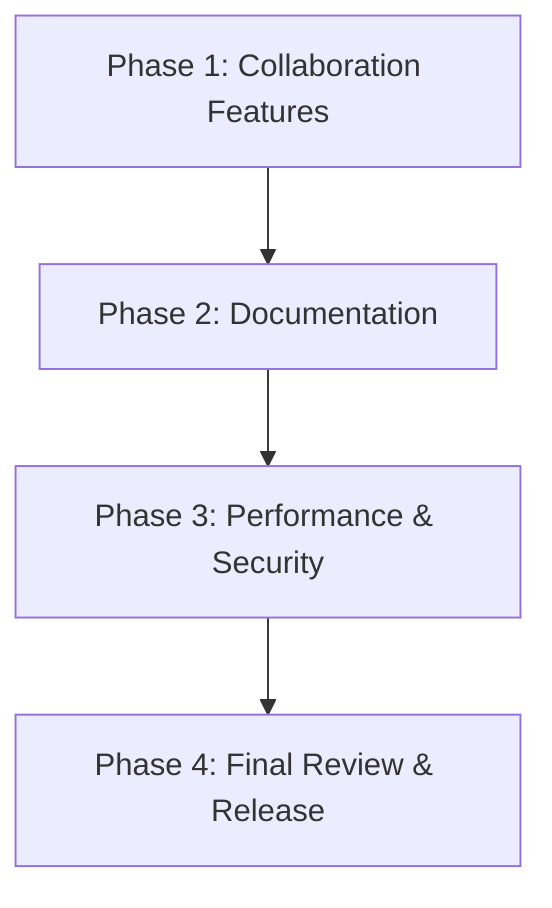
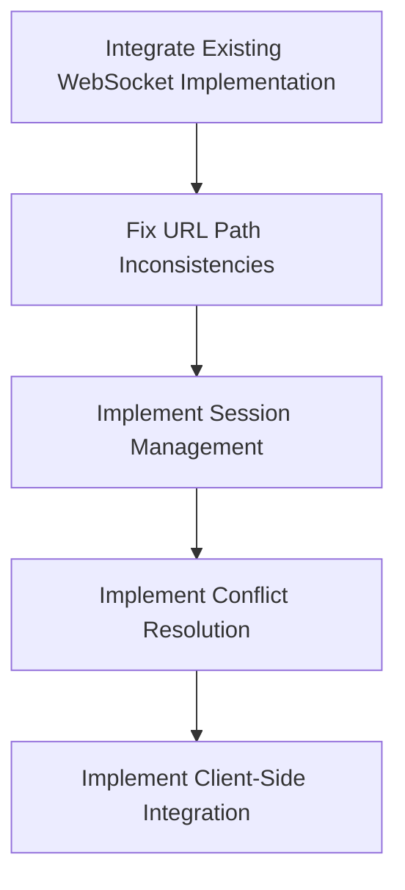

# API Implementation Next Steps

## Current Status Summary

The implementation has successfully completed:

- Phase 1: Update Gin Adapter
- Phase 2: Update Threat Model Handlers
- Phase 3: Implement Nested Diagram Handlers
- Phase 4: Create ThreatModelDiagramHandler
- Phase 5: Update Data Models and Relationships
- Phase 6: Update Handler Implementation for Schema Changes
- Phase 7: Implement Tests for ThreatModelDiagramHandler

The main gaps are:

1. Placeholder implementations for collaboration features (WebSocket integration)
2. Lack of comprehensive documentation
3. No performance or security testing

## Implementation Plan

### Phase 1: Collaboration Features (Estimated time: 2-3 weeks)

**Tasks:**

1. Integrate existing WebSocket implementation:

   - Review existing WebSocket functionality in `websocket.go`
   - Identify integration points with ThreatModelDiagramHandler
   - Update ThreatModelDiagramHandler to use the WebSocketHub

2. Fix URL path inconsistencies:

   - Resolve discrepancy between WebSocket handler path ("/ws/diagrams/:id") and the path returned by ThreatModelDiagramHandler ("/threat_models/:id/diagrams/:diagram_id/ws")
   - Update server.go to register WebSocket handlers at the correct paths
   - Ensure consistent URL patterns across the API

3. Implement session management:

   - Update `GetThreatModelDiagramCollaborate` to return actual session information from WebSocketHub
   - Update `PostThreatModelDiagramCollaborate` to create or join a session using WebSocketHub
   - Update `DeleteThreatModelDiagramCollaborate` to leave a session using WebSocketHub

4. Implement conflict resolution:

   - Enhance the existing DiagramOperation handling in websocket.go
   - Implement operational transformation or similar algorithm
   - Handle concurrent edits to the same diagram
   - Ensure consistency across all clients

5. Implement client-side integration:
   - Create example client code for connecting to collaboration sessions
   - Document WebSocket API for client developers

### Phase 2: Documentation (Estimated time: 1 week)

**Tasks:**

1. Update API documentation:

   - Document all endpoints with request/response examples
   - Update OpenAPI specification if needed
   - Document error responses

2. Create usage examples:

   - Example of creating a threat model and adding diagrams
   - Example of collaborating on a diagram
   - Example of managing authorization

3. Document authentication and authorization:

   - Explain how authentication works
   - Document authorization rules for different endpoints
   - Provide examples of working with different user roles

4. Create integration guide:
   - Guide for integrating with the API
   - Best practices for error handling
   - Performance considerations

### Phase 3: Performance & Security (Estimated time: 1-2 weeks)

**Tasks:**

1. Performance testing:

   - Test with large threat models containing many diagrams
   - Test collaboration with multiple concurrent users
   - Measure response times and resource usage

2. Identify bottlenecks:

   - Analyze performance test results
   - Identify slow endpoints or operations
   - Determine resource constraints

3. Optimize critical paths:

   - Implement caching where appropriate
   - Optimize database queries
   - Improve concurrency handling

4. Security review:

   - Review authentication and authorization implementation
   - Check for common vulnerabilities (OWASP Top 10)
   - Ensure proper input validation and output sanitization

5. Fix security issues:
   - Address any identified vulnerabilities
   - Implement additional security measures if needed
   - Document security considerations for API users

### Phase 4: Final Review & Release (Estimated time: 1 week)

**Tasks:**

1. Code review:

   - Review all implemented code
   - Ensure code quality and consistency
   - Address any technical debt

2. Integration testing:

   - Test the API as a whole
   - Verify that all endpoints work together correctly
   - Test with realistic scenarios

3. Documentation review:

   - Review all documentation
   - Ensure accuracy and completeness
   - Address any gaps or inconsistencies

4. Release preparation:

   - Create release notes
   - Update version numbers
   - Prepare deployment plan

5. Release:
   - Deploy the API
   - Monitor for issues
   - Provide support for initial users

## Prioritization

1. **High Priority**:

   - Implementing real collaboration features by integrating ThreatModelDiagramHandler with WebSocket functionality
   - Fixing any security issues
   - Resolving WebSocket URL path inconsistencies

2. **Medium Priority**:

   - Updating API documentation
   - Performance testing and optimization
   - Integration testing

3. **Lower Priority**:
   - Creating usage examples
   - Creating integration guide
   - Final code review and cleanup

## Resource Requirements

1. **Development Resources**:

   - 1-2 backend developers familiar with Go and the Gin framework
   - 1 frontend developer for client-side integration (if needed)

2. **Testing Resources**:

   - 1 QA engineer for testing
   - Load testing infrastructure for performance testing

3. **Documentation Resources**:
   - 1 technical writer or developer with documentation skills

## Risk Assessment

1. **High Risk**:

   - Collaboration feature complexity
   - Performance with large threat models
   - Security vulnerabilities

2. **Medium Risk**:

   - Integration with existing systems
   - Backward compatibility
   - Testing coverage

3. **Low Risk**:
   - Documentation completeness
   - API usability
   - Deployment issues

## Mitigation Strategies

1. For collaboration complexity:

   - Start with a simple implementation and iterate
   - Consider using existing libraries or frameworks
   - Implement thorough testing

2. For performance risks:

   - Implement performance testing early
   - Design with scalability in mind
   - Identify and optimize critical paths

3. For security risks:
   - Conduct security review early
   - Follow security best practices
   - Implement proper input validation and output sanitization
