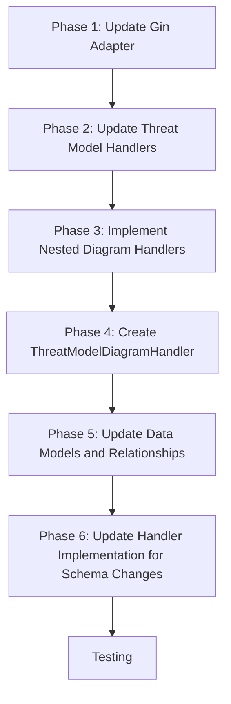

# API Implementation Plan

## Overview

This document outlines the plan for implementing the missing API endpoints in the TMI (Threat Modeling Improved) service according to the updated OpenAPI specification. The plan accounts for recent schema changes including additional fields in threat models, threats, and diagrams, as well as the removal of authorization data directly from diagrams (which now inherit authorization information from their parent threat model).

## Current Status

The codebase already has:

- OpenAPI specification (tmi-openapi.json) defining a complete API for threat modeling with collaborative diagram editing
- Many endpoints already implemented, particularly:
  - Root endpoint (`/`)
  - Authentication endpoints (`/auth/*`)
  - Standalone diagram endpoints (`/diagrams/*`)
  - Basic threat model endpoints (`/threat_models/*`)

However, there are two main gaps in the implementation:

1. The threat model endpoints in main.go use mock implementations instead of the proper ThreatModelHandler
2. The nested endpoints for diagrams within threat models are missing entirely

## Missing Endpoints

The following endpoints defined in the OpenAPI spec are not implemented:

1. `/threat_models/{threat_model_id}/diagrams` (GET, POST)
2. `/threat_models/{threat_model_id}/diagrams/{diagram_id}` (GET, PUT, PATCH, DELETE)
3. `/threat_models/{threat_model_id}/diagrams/{diagram_id}/collaborate` (GET, POST, DELETE)

## Implementation Plan

### Phase 1: Update Gin Adapter

1. Update the `GinServerInterface` in `api/gin_adapter.go` to include the missing endpoints:

```go
// GinServerInterface extends ServerInterface for Gin
type GinServerInterface interface {
    // Existing endpoints...

    // Threat Model Diagrams
    GetThreatModelsThreatModelIdDiagrams(c *gin.Context, threatModelId string)
    PostThreatModelsThreatModelIdDiagrams(c *gin.Context, threatModelId string)
    GetThreatModelsThreatModelIdDiagramsDiagramId(c *gin.Context, threatModelId, diagramId string)
    PutThreatModelsThreatModelIdDiagramsDiagramId(c *gin.Context, threatModelId, diagramId string)
    PatchThreatModelsThreatModelIdDiagramsDiagramId(c *gin.Context, threatModelId, diagramId string)
    DeleteThreatModelsThreatModelIdDiagramsDiagramId(c *gin.Context, threatModelId, diagramId string)

    // Threat Model Diagram Collaboration
    GetThreatModelsThreatModelIdDiagramsDiagramIdCollaborate(c *gin.Context, threatModelId, diagramId string)
    PostThreatModelsThreatModelIdDiagramsDiagramIdCollaborate(c *gin.Context, threatModelId, diagramId string)
    DeleteThreatModelsThreatModelIdDiagramsDiagramIdCollaborate(c *gin.Context, threatModelId, diagramId string)
}
```

2. Update the `RegisterGinHandlers` function to register these new endpoints:

```go
// RegisterHandlers registers the API handlers to a Gin router
func RegisterGinHandlers(r GinRouter, si GinServerInterface) {
    // Existing registrations...

    // Threat Model Diagrams
    r.GET("/threat_models/:threat_model_id/diagrams", si.GetThreatModelsThreatModelIdDiagrams)
    r.POST("/threat_models/:threat_model_id/diagrams", si.PostThreatModelsThreatModelIdDiagrams)
    r.GET("/threat_models/:threat_model_id/diagrams/:diagram_id", si.GetThreatModelsThreatModelIdDiagramsDiagramId)
    r.PUT("/threat_models/:threat_model_id/diagrams/:diagram_id", si.PutThreatModelsThreatModelIdDiagramsDiagramId)
    r.PATCH("/threat_models/:threat_model_id/diagrams/:diagram_id", si.PatchThreatModelsThreatModelIdDiagramsDiagramId)
    r.DELETE("/threat_models/:threat_model_id/diagrams/:diagram_id", si.DeleteThreatModelsThreatModelIdDiagramsDiagramId)

    // Threat Model Diagram Collaboration
    r.GET("/threat_models/:threat_model_id/diagrams/:diagram_id/collaborate", si.GetThreatModelsThreatModelIdDiagramsDiagramIdCollaborate)
    r.POST("/threat_models/:threat_model_id/diagrams/:diagram_id/collaborate", si.PostThreatModelsThreatModelIdDiagramsDiagramIdCollaborate)
    r.DELETE("/threat_models/:threat_model_id/diagrams/:diagram_id/collaborate", si.DeleteThreatModelsThreatModelIdDiagramsDiagramIdCollaborate)
}
```

### Phase 2: Update Threat Model Handlers

Replace the mock implementations in `cmd/server/main.go` with proper calls to the ThreatModelHandler:

```go
func (s *Server) GetThreatModels(c *gin.Context) {
    threatModelHandler := api.NewThreatModelHandler()
    threatModelHandler.GetThreatModels(c)
}

func (s *Server) PostThreatModels(c *gin.Context) {
    threatModelHandler := api.NewThreatModelHandler()
    threatModelHandler.CreateThreatModel(c)
}

func (s *Server) GetThreatModelsId(c *gin.Context) {
    threatModelHandler := api.NewThreatModelHandler()
    threatModelHandler.GetThreatModelByID(c)
}

func (s *Server) PutThreatModelsId(c *gin.Context) {
    threatModelHandler := api.NewThreatModelHandler()
    threatModelHandler.UpdateThreatModel(c)
}

func (s *Server) PatchThreatModelsId(c *gin.Context) {
    threatModelHandler := api.NewThreatModelHandler()
    threatModelHandler.PatchThreatModel(c)
}

func (s *Server) DeleteThreatModelsId(c *gin.Context) {
    threatModelHandler := api.NewThreatModelHandler()
    threatModelHandler.DeleteThreatModel(c)
}
```

### Phase 3: Implement Nested Diagram Handlers

Add the following handler methods to the `Server` struct in `cmd/server/main.go`:

```go
// Threat Model Diagrams
func (s *Server) GetThreatModelsThreatModelIdDiagrams(c *gin.Context) {
    threatModelId := c.Param("threat_model_id")
    // Create a new handler for diagrams within threat models
    handler := api.NewThreatModelDiagramHandler()
    handler.GetDiagrams(c, threatModelId)
}

func (s *Server) PostThreatModelsThreatModelIdDiagrams(c *gin.Context) {
    threatModelId := c.Param("threat_model_id")
    handler := api.NewThreatModelDiagramHandler()
    handler.CreateDiagram(c, threatModelId)
}

func (s *Server) GetThreatModelsThreatModelIdDiagramsDiagramId(c *gin.Context) {
    threatModelId := c.Param("threat_model_id")
    diagramId := c.Param("diagram_id")
    handler := api.NewThreatModelDiagramHandler()
    handler.GetDiagramByID(c, threatModelId, diagramId)
}

func (s *Server) PutThreatModelsThreatModelIdDiagramsDiagramId(c *gin.Context) {
    threatModelId := c.Param("threat_model_id")
    diagramId := c.Param("diagram_id")
    handler := api.NewThreatModelDiagramHandler()
    handler.UpdateDiagram(c, threatModelId, diagramId)
}

func (s *Server) PatchThreatModelsThreatModelIdDiagramsDiagramId(c *gin.Context) {
    threatModelId := c.Param("threat_model_id")
    diagramId := c.Param("diagram_id")
    handler := api.NewThreatModelDiagramHandler()
    handler.PatchDiagram(c, threatModelId, diagramId)
}

func (s *Server) DeleteThreatModelsThreatModelIdDiagramsDiagramId(c *gin.Context) {
    threatModelId := c.Param("threat_model_id")
    diagramId := c.Param("diagram_id")
    handler := api.NewThreatModelDiagramHandler()
    handler.DeleteDiagram(c, threatModelId, diagramId)
}

// Threat Model Diagram Collaboration
func (s *Server) GetThreatModelsThreatModelIdDiagramsDiagramIdCollaborate(c *gin.Context) {
    threatModelId := c.Param("threat_model_id")
    diagramId := c.Param("diagram_id")
    handler := api.NewThreatModelDiagramHandler()
    handler.GetDiagramCollaborate(c, threatModelId, diagramId)
}

func (s *Server) PostThreatModelsThreatModelIdDiagramsDiagramIdCollaborate(c *gin.Context) {
    threatModelId := c.Param("threat_model_id")
    diagramId := c.Param("diagram_id")
    handler := api.NewThreatModelDiagramHandler()
    handler.PostDiagramCollaborate(c, threatModelId, diagramId)
}

func (s *Server) DeleteThreatModelsThreatModelIdDiagramsDiagramIdCollaborate(c *gin.Context) {
    threatModelId := c.Param("threat_model_id")
    diagramId := c.Param("diagram_id")
    handler := api.NewThreatModelDiagramHandler()
    handler.DeleteDiagramCollaborate(c, threatModelId, diagramId)
}
```

### Phase 4: Create ThreatModelDiagramHandler

Create a new file `api/threat_model_diagram_handlers.go` to implement the handlers for diagrams within threat models:

```go
package api

import (
    "fmt"
    "net/http"
    "time"

    "github.com/gin-gonic/gin"
)

// ThreatModelDiagramHandler provides handlers for diagram operations within threat models
type ThreatModelDiagramHandler struct {
    // Could add dependencies like logger, metrics, etc.
}

// NewThreatModelDiagramHandler creates a new handler for diagrams within threat models
func NewThreatModelDiagramHandler() *ThreatModelDiagramHandler {
    return &ThreatModelDiagramHandler{}
}

// GetDiagrams returns a list of diagrams for a threat model
func (h *ThreatModelDiagramHandler) GetDiagrams(c *gin.Context, threatModelId string) {
    // Parse pagination parameters
    limit := parseIntParam(c.DefaultQuery("limit", "20"), 20)
    offset := parseIntParam(c.DefaultQuery("offset", "0"), 0)

    // Get username from JWT claim
    userID, _ := c.Get("userName")
    userName, ok := userID.(string)
    if !ok {
        userName = ""
    }

    // Get the threat model to check access
    tm, err := ThreatModelStore.Get(threatModelId)
    if err != nil {
        c.JSON(http.StatusNotFound, Error{
            Error:   "not_found",
            Message: "Threat model not found",
        })
        return
    }

    // Check if user has access to the threat model
    if err := CheckThreatModelAccess(userName, tm, RoleReader); err != nil {
        c.JSON(http.StatusForbidden, Error{
            Error:   "forbidden",
            Message: "You don't have sufficient permissions to access this threat model",
        })
        return
    }

    // Get diagrams associated with this threat model
    var diagrams []Diagram
    if tm.Diagrams != nil {
        for _, diagramID := range *tm.Diagrams {
            diagram, err := DiagramStore.Get(diagramID.String())
            if err == nil {
                diagrams = append(diagrams, diagram)
            }
        }
    }

    // Apply pagination
    start := offset
    end := offset + limit
    if start >= len(diagrams) {
        start = len(diagrams)
    }
    if end > len(diagrams) {
        end = len(diagrams)
    }

    paginatedDiagrams := diagrams
    if start < end {
        paginatedDiagrams = diagrams[start:end]
    } else {
        paginatedDiagrams = []Diagram{}
    }

    // Convert to list items for API response
    items := make([]ListItem, 0, len(paginatedDiagrams))
    for _, d := range paginatedDiagrams {
        items = append(items, ListItem{
            Id:   d.Id,
            Name: d.Name,
        })
    }

    c.JSON(http.StatusOK, items)
}

// CreateDiagram creates a new diagram for a threat model
func (h *ThreatModelDiagramHandler) CreateDiagram(c *gin.Context, threatModelId string) {
    var request struct {
        Name        string  `json:"name" binding:"required"`
        Description *string `json:"description,omitempty"`
    }

    if err := c.ShouldBindJSON(&request); err != nil {
        c.JSON(http.StatusBadRequest, Error{
            Error:   "invalid_input",
            Message: err.Error(),
        })
        return
    }

    // Get username from JWT claim
    userID, _ := c.Get("userName")
    userName, ok := userID.(string)
    if !ok || userName == "" {
        c.JSON(http.StatusUnauthorized, Error{
            Error:   "unauthorized",
            Message: "Authentication required",
        })
        return
    }

    // Get the threat model to check access
    tm, err := ThreatModelStore.Get(threatModelId)
    if err != nil {
        c.JSON(http.StatusNotFound, Error{
            Error:   "not_found",
            Message: "Threat model not found",
        })
        return
    }

    // Check if user has write access to the threat model
    if err := CheckThreatModelAccess(userName, tm, RoleWriter); err != nil {
        c.JSON(http.StatusForbidden, Error{
            Error:   "forbidden",
            Message: "You don't have sufficient permissions to create diagrams in this threat model",
        })
        return
    }

    // Create new diagram
    now := time.Now().UTC()
    cells := []Cell{}
    metadata := []Metadata{}

    d := Diagram{
        Name:        request.Name,
        Description: request.Description,
        CreatedAt:   now,
        ModifiedAt:  now,
        GraphData:   &cells,
        Metadata:    &metadata,
    }

    // Add to store
    idSetter := func(d Diagram, id string) Diagram {
        uuid, _ := ParseUUID(id)
        d.Id = uuid
        return d
    }

    createdDiagram, err := DiagramStore.Create(d, idSetter)
    if err != nil {
        c.JSON(http.StatusInternalServerError, Error{
            Error:   "server_error",
            Message: "Failed to create diagram",
        })
        return
    }

    // Add diagram ID to threat model's diagrams array
    if tm.Diagrams == nil {
        diagrams := []TypesUUID{createdDiagram.Id}
        tm.Diagrams = &diagrams
    } else {
        *tm.Diagrams = append(*tm.Diagrams, createdDiagram.Id)
    }

    // Update threat model in store
    tm.ModifiedAt = now
    if err := ThreatModelStore.Update(threatModelId, tm); err != nil {
        // If updating the threat model fails, delete the created diagram
        DiagramStore.Delete(createdDiagram.Id.String())
        c.JSON(http.StatusInternalServerError, Error{
            Error:   "server_error",
            Message: "Failed to update threat model with new diagram",
        })
        return
    }

    // Set the Location header
    c.Header("Location", fmt.Sprintf("/threat_models/%s/diagrams/%s", threatModelId, createdDiagram.Id.String()))
    c.JSON(http.StatusCreated, createdDiagram)
}

// GetDiagramByID retrieves a specific diagram within a threat model
func (h *ThreatModelDiagramHandler) GetDiagramByID(c *gin.Context, threatModelId, diagramId string) {
    // Get username from JWT claim
    userID, _ := c.Get("userName")
    userName, ok := userID.(string)
    if !ok {
        userName = ""
    }

    // Get the threat model to check access
    tm, err := ThreatModelStore.Get(threatModelId)
    if err != nil {
        c.JSON(http.StatusNotFound, Error{
            Error:   "not_found",
            Message: "Threat model not found",
        })
        return
    }

    // Check if user has access to the threat model
    if err := CheckThreatModelAccess(userName, tm, RoleReader); err != nil {
        c.JSON(http.StatusForbidden, Error{
            Error:   "forbidden",
            Message: "You don't have sufficient permissions to access this threat model",
        })
        return
    }

    // Check if the diagram is associated with this threat model
    diagramFound := false
    if tm.Diagrams != nil {
        for _, id := range *tm.Diagrams {
            if id.String() == diagramId {
                diagramFound = true
                break
            }
        }
    }

    if !diagramFound {
        c.JSON(http.StatusNotFound, Error{
            Error:   "not_found",
            Message: "Diagram not found in this threat model",
        })
        return
    }

    // Get diagram from store
    diagram, err := DiagramStore.Get(diagramId)
    if err != nil {
        c.JSON(http.StatusNotFound, Error{
            Error:   "not_found",
            Message: "Diagram not found",
        })
        return
    }

    c.JSON(http.StatusOK, diagram)
}

// UpdateDiagram fully updates a diagram within a threat model
func (h *ThreatModelDiagramHandler) UpdateDiagram(c *gin.Context, threatModelId, diagramId string) {
    // Implementation similar to GetDiagramByID but with update logic
    // ...
}

// PatchDiagram partially updates a diagram within a threat model
func (h *ThreatModelDiagramHandler) PatchDiagram(c *gin.Context, threatModelId, diagramId string) {
    // Implementation similar to GetDiagramByID but with patch logic
    // ...
}

// DeleteDiagram deletes a diagram within a threat model
func (h *ThreatModelDiagramHandler) DeleteDiagram(c *gin.Context, threatModelId, diagramId string) {
    // Implementation similar to GetDiagramByID but with delete logic
    // ...
}

// GetDiagramCollaborate gets collaboration session status for a diagram within a threat model
func (h *ThreatModelDiagramHandler) GetDiagramCollaborate(c *gin.Context, threatModelId, diagramId string) {
    // Implementation similar to GetDiagramByID but with collaboration logic
    // ...
}

// PostDiagramCollaborate joins or starts a collaboration session for a diagram within a threat model
func (h *ThreatModelDiagramHandler) PostDiagramCollaborate(c *gin.Context, threatModelId, diagramId string) {
    // Implementation similar to GetDiagramByID but with collaboration logic
    // ...
}

// DeleteDiagramCollaborate leaves a collaboration session for a diagram within a threat model
func (h *ThreatModelDiagramHandler) DeleteDiagramCollaborate(c *gin.Context, threatModelId, diagramId string) {
    // Implementation similar to GetDiagramByID but with collaboration logic
    // ...
}
```

### Phase 5: Update Data Models and Relationships

Ensure that the relationship between threat models and diagrams is properly maintained:

1. When creating a diagram within a threat model, add the diagram ID to the threat model's diagrams array
2. When deleting a diagram within a threat model, remove the diagram ID from the threat model's diagrams array
3. Ensure that access control is properly enforced (a user with access to a threat model should have the same level of access to its diagrams)
4. Handle the inheritance of authorization information from threat models to diagrams
   - Diagrams no longer have their own authorization data
   - Diagrams inherit authorization from their parent threat model
   - Access checks for diagrams should use the parent threat model's authorization data
5. Support additional fields in the updated schema:
   - Threat models: metadata, issue_url, threat_model_framework
   - Threats: metadata, mitigated, priority, score, status, threat_type
   - Diagrams: metadata, version

### Phase 6: Update Handler Implementation for Schema Changes

Update the handler implementations to account for the schema changes:

1. Update the `CreateDiagram` method in `ThreatModelDiagramHandler` to:

   - No longer set authorization data directly on diagrams
   - Set the new metadata and version fields
   - Properly link the diagram to the parent threat model

2. Update the `GetDiagramByID` method to:

   - Use the parent threat model's authorization data for access control
   - Return the diagram with all new fields properly populated

3. Update the `UpdateDiagram` and `PatchDiagram` methods to:

   - Handle the new fields in the schema
   - Maintain the relationship with the parent threat model
   - Ensure authorization is checked against the parent threat model

4. Update the threat model handlers to:
   - Support the new fields in threat models and threats
   - Properly manage the relationship between threat models, threats, and diagrams

## Implementation Sequence



## Testing Strategy

1. Unit tests for each new handler method
2. Integration tests for the API endpoints
3. End-to-end tests for the complete flow (create threat model, add diagram, collaborate)
4. Specific tests for schema changes:
   - Test that diagrams correctly inherit authorization from parent threat models
   - Test the handling of new fields in threat models, threats, and diagrams
   - Test that authorization checks use the parent threat model's data for diagrams
   - Test that relationships between threat models, diagrams, and threats are maintained correctly
5. Regression tests to ensure existing functionality continues to work with the schema changes
