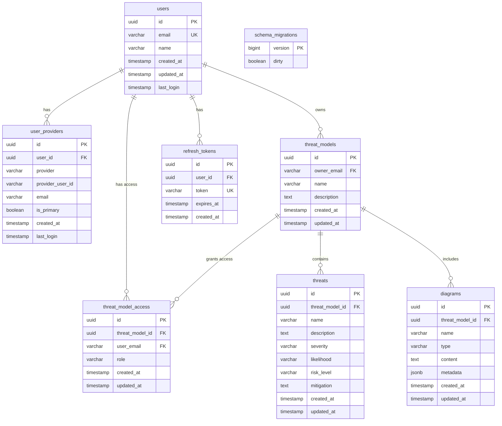

# PostgreSQL Database Schema Documentation

This document provides comprehensive documentation of the TMI (Threat Model Intelligence) application's PostgreSQL database schema, including entity relationships, data types, constraints, and design decisions.

## Table of Contents

1. [Schema Overview](#schema-overview)
2. [Entity Relationship Diagram](#entity-relationship-diagram)
3. [Table Definitions](#table-definitions)
4. [Relationships and Foreign Keys](#relationships-and-foreign-keys)
5. [Indexes](#indexes)
6. [Constraints](#constraints)
7. [Data Types and Field Lengths](#data-types-and-field-lengths)
8. [Design Patterns](#design-patterns)
9. [Schema Evolution](#schema-evolution)

## Schema Overview

The TMI database schema is designed to support a multi-tenant threat modeling application with the following key features:

- **OAuth-based Authentication**: No password storage, supports multiple providers
- **Role-Based Access Control (RBAC)**: Granular permissions for threat models
- **Hierarchical Data Model**: Threat models contain threats and diagrams
- **Audit Trail**: All entities track creation and modification timestamps
- **Data Integrity**: Enforced through foreign keys and CHECK constraints
- **Performance Optimization**: Strategic indexes for common query patterns

### Core Entities

1. **Users**: Application users authenticated via OAuth
2. **User Providers**: Links between users and OAuth providers
3. **Threat Models**: Main business entities containing security analysis
4. **Threat Model Access**: Authorization matrix for threat models
5. **Threats**: Individual security threats within models
6. **Diagrams**: Visual representations associated with threat models
7. **Refresh Tokens**: OAuth session management
8. **Schema Migrations**: Database version tracking

## Entity Relationship Diagram

The following diagram illustrates the relationships between database tables:



## Table Definitions

### 1. users

Central user account table for authentication and identification.

| Column     | Type         | Nullable | Default           | Description                                |
| ---------- | ------------ | -------- | ----------------- | ------------------------------------------ |
| id         | uuid         | NO       | gen_random_uuid() | Primary key                                |
| email      | varchar(320) | NO       | -                 | Unique email address (RFC 5321 max length) |
| name       | varchar(255) | NO       | -                 | Display name                               |
| created_at | timestamp    | NO       | CURRENT_TIMESTAMP | Account creation time                      |
| updated_at | timestamp    | NO       | CURRENT_TIMESTAMP | Last modification time                     |
| last_login | timestamp    | YES      | -                 | Last successful login                      |

**Indexes:**

- PRIMARY KEY on `id`
- UNIQUE on `email`
- INDEX on `email` for lookups
- INDEX on `last_login` for activity queries

### 2. user_providers

Links OAuth providers to user accounts, supporting multiple authentication methods.

| Column           | Type         | Nullable | Default           | Description                  |
| ---------------- | ------------ | -------- | ----------------- | ---------------------------- |
| id               | uuid         | NO       | gen_random_uuid() | Primary key                  |
| user_id          | uuid         | NO       | -                 | Reference to users.id        |
| provider         | varchar(50)  | NO       | -                 | OAuth provider name          |
| provider_user_id | varchar(255) | NO       | -                 | User ID from provider        |
| email            | varchar(320) | NO       | -                 | Email from provider          |
| is_primary       | boolean      | YES      | false             | Primary provider flag        |
| created_at       | timestamp    | NO       | CURRENT_TIMESTAMP | Link creation time           |
| last_login       | timestamp    | YES      | -                 | Last login via this provider |

**Indexes:**

- PRIMARY KEY on `id`
- UNIQUE on `(user_id, provider)`
- INDEX on `user_id`
- INDEX on `(provider, provider_user_id)` for OAuth lookups
- INDEX on `email`
- INDEX on `(user_id, is_primary)`
- PARTIAL UNIQUE INDEX on `user_id WHERE is_primary = true`

**Constraints:**

- FOREIGN KEY `user_id` REFERENCES `users(id)` ON DELETE CASCADE
- CHECK `provider IN ('google', 'github', 'microsoft', 'apple', 'facebook', 'twitter')`
- CHECK `provider_user_id != ''`

### 3. threat_models

Main business entity containing threat analysis documentation.

| Column      | Type         | Nullable | Default           | Description            |
| ----------- | ------------ | -------- | ----------------- | ---------------------- |
| id          | uuid         | NO       | gen_random_uuid() | Primary key            |
| owner_email | varchar(320) | NO       | -                 | Owner's email address  |
| name        | varchar(255) | NO       | -                 | Model name             |
| description | text         | YES      | -                 | Detailed description   |
| created_at  | timestamp    | NO       | CURRENT_TIMESTAMP | Creation time          |
| updated_at  | timestamp    | NO       | CURRENT_TIMESTAMP | Last modification time |

**Indexes:**

- PRIMARY KEY on `id`
- INDEX on `owner_email` for owner queries

**Constraints:**

- FOREIGN KEY `owner_email` REFERENCES `users(email)` ON DELETE CASCADE

### 4. threat_model_access

Authorization matrix implementing role-based access control.

| Column          | Type         | Nullable | Default           | Description                   |
| --------------- | ------------ | -------- | ----------------- | ----------------------------- |
| id              | uuid         | NO       | gen_random_uuid() | Primary key                   |
| threat_model_id | uuid         | NO       | -                 | Reference to threat_models.id |
| user_email      | varchar(320) | NO       | -                 | User's email address          |
| role            | varchar(50)  | NO       | -                 | Access role                   |
| created_at      | timestamp    | NO       | CURRENT_TIMESTAMP | Grant time                    |
| updated_at      | timestamp    | NO       | CURRENT_TIMESTAMP | Last modification time        |

**Indexes:**

- PRIMARY KEY on `id`
- UNIQUE on `(threat_model_id, user_email)`
- INDEX on `threat_model_id`
- INDEX on `user_email`
- INDEX on `role`

**Constraints:**

- FOREIGN KEY `threat_model_id` REFERENCES `threat_models(id)` ON DELETE CASCADE
- FOREIGN KEY `user_email` REFERENCES `users(email)` ON DELETE CASCADE
- CHECK `role IN ('owner', 'writer', 'reader')`

### 5. threats

Individual security threats identified within threat models.

| Column          | Type         | Nullable | Default           | Description              |
| --------------- | ------------ | -------- | ----------------- | ------------------------ |
| id              | uuid         | NO       | gen_random_uuid() | Primary key              |
| threat_model_id | uuid         | NO       | -                 | Parent threat model      |
| name            | varchar(255) | NO       | -                 | Threat name              |
| description     | text         | YES      | -                 | Detailed description     |
| severity        | varchar(20)  | YES      | -                 | Severity level           |
| likelihood      | varchar(20)  | YES      | -                 | Likelihood of occurrence |
| risk_level      | varchar(20)  | YES      | -                 | Calculated risk level    |
| mitigation      | text         | YES      | -                 | Mitigation strategies    |
| created_at      | timestamp    | NO       | CURRENT_TIMESTAMP | Creation time            |
| updated_at      | timestamp    | NO       | CURRENT_TIMESTAMP | Last modification time   |

**Indexes:**

- PRIMARY KEY on `id`
- INDEX on `threat_model_id`
- INDEX on `severity`
- INDEX on `risk_level`
- INDEX on `(threat_model_id, created_at)` for sorted listings

**Constraints:**

- FOREIGN KEY `threat_model_id` REFERENCES `threat_models(id)` ON DELETE CASCADE
- CHECK `severity IS NULL OR severity IN ('low', 'medium', 'high', 'critical')`
- CHECK `likelihood IS NULL OR likelihood IN ('low', 'medium', 'high')`
- CHECK `risk_level IS NULL OR risk_level IN ('low', 'medium', 'high', 'critical')`

### 6. diagrams

Visual representations and architectural diagrams for threat models.

| Column          | Type         | Nullable | Default           | Description                       |
| --------------- | ------------ | -------- | ----------------- | --------------------------------- |
| id              | uuid         | NO       | gen_random_uuid() | Primary key                       |
| threat_model_id | uuid         | NO       | -                 | Parent threat model               |
| name            | varchar(255) | NO       | -                 | Diagram name                      |
| type            | varchar(50)  | YES      | -                 | Diagram type                      |
| content         | text         | YES      | -                 | Diagram content (e.g., SVG, JSON) |
| metadata        | jsonb        | YES      | -                 | Additional metadata               |
| created_at      | timestamp    | NO       | CURRENT_TIMESTAMP | Creation time                     |
| updated_at      | timestamp    | NO       | CURRENT_TIMESTAMP | Last modification time            |

**Indexes:**

- PRIMARY KEY on `id`
- INDEX on `threat_model_id`
- INDEX on `type`
- INDEX on `(threat_model_id, type)` for filtered queries

**Constraints:**

- FOREIGN KEY `threat_model_id` REFERENCES `threat_models(id)` ON DELETE CASCADE
- CHECK `type IS NULL OR type IN ('data_flow', 'architecture', 'sequence', 'component', 'deployment')`

### 7. refresh_tokens

OAuth refresh token storage for session management.

| Column     | Type         | Nullable | Default           | Description         |
| ---------- | ------------ | -------- | ----------------- | ------------------- |
| id         | uuid         | NO       | gen_random_uuid() | Primary key         |
| user_id    | uuid         | NO       | -                 | Token owner         |
| token      | varchar(512) | NO       | -                 | Refresh token value |
| expires_at | timestamp    | NO       | -                 | Expiration time     |
| created_at | timestamp    | NO       | CURRENT_TIMESTAMP | Creation time       |

**Indexes:**

- PRIMARY KEY on `id`
- UNIQUE on `token`
- INDEX on `user_id`
- INDEX on `token` for lookups

**Constraints:**

- FOREIGN KEY `user_id` REFERENCES `users(id)` ON DELETE CASCADE
- CHECK `expires_at > created_at`

### 8. schema_migrations

Database migration tracking for version control.

| Column  | Type    | Nullable | Default | Description              |
| ------- | ------- | -------- | ------- | ------------------------ |
| version | bigint  | NO       | -       | Migration version number |
| dirty   | boolean | NO       | false   | Migration state flag     |

**Indexes:**

- PRIMARY KEY on `version`

## Relationships and Foreign Keys

### Cascade Delete Behavior

All foreign key relationships use `ON DELETE CASCADE` to maintain referential integrity:

1. **User Deletion**: Removes all associated:

   - User providers
   - Owned threat models (which cascades to threats and diagrams)
   - Access grants
   - Refresh tokens

2. **Threat Model Deletion**: Removes all associated:
   - Access grants
   - Threats
   - Diagrams

### Relationship Cardinality

- **One-to-Many**:

  - users → user_providers
  - users → refresh_tokens
  - threat_models → threats
  - threat_models → diagrams

- **Many-to-Many** (via junction table):
  - users ↔ threat_models (via threat_model_access)

## Indexes

### Performance Indexes

Indexes are strategically placed to optimize common query patterns:

1. **Authentication Queries**:

   - `idx_users_email`: User lookup by email
   - `idx_user_providers_provider_lookup`: OAuth provider verification

2. **Authorization Queries**:

   - `idx_threat_model_access_user_email`: User's accessible models
   - `idx_threat_model_access_threat_model_id`: Model's authorized users

3. **Business Logic Queries**:

   - `idx_threats_threat_model_id_created_at`: Chronological threat listing
   - `idx_diagrams_threat_model_id_type`: Filtered diagram retrieval

4. **Administrative Queries**:
   - `idx_users_last_login`: User activity monitoring
   - `idx_user_providers_user_id_is_primary`: Primary provider lookup

### Unique Constraints

Implemented via unique indexes:

1. `users_email_key`: Ensures unique user emails
2. `user_providers_user_id_provider_key`: One provider link per user/provider
3. `threat_model_access_threat_model_id_user_email_key`: Single access entry per user/model
4. `refresh_tokens_token_key`: Unique refresh tokens
5. `idx_user_providers_one_primary`: Ensures only one primary provider per user (partial index)

## Constraints

### CHECK Constraints

Data integrity is enforced at the database level:

1. **Provider Validation**:

   ```sql
   CONSTRAINT user_providers_provider_check
   CHECK (provider IN ('google', 'github', 'microsoft', 'apple', 'facebook', 'twitter'))
   ```

2. **Empty String Prevention**:

   ```sql
   CONSTRAINT user_providers_provider_user_id_check
   CHECK (provider_user_id != '')
   ```

3. **Role-Based Access Control**:

   ```sql
   CONSTRAINT threat_model_access_role_check
   CHECK (role IN ('owner', 'writer', 'reader'))
   ```

4. **Risk Assessment Enums**:

   ```sql
   CONSTRAINT threats_severity_check
   CHECK (severity IS NULL OR severity IN ('low', 'medium', 'high', 'critical'))

   CONSTRAINT threats_likelihood_check
   CHECK (likelihood IS NULL OR likelihood IN ('low', 'medium', 'high'))

   CONSTRAINT threats_risk_level_check
   CHECK (risk_level IS NULL OR risk_level IN ('low', 'medium', 'high', 'critical'))
   ```

5. **Diagram Type Validation**:

   ```sql
   CONSTRAINT diagrams_type_check
   CHECK (type IS NULL OR type IN ('data_flow', 'architecture', 'sequence', 'component', 'deployment'))
   ```

6. **Token Expiration Logic**:
   ```sql
   CONSTRAINT refresh_tokens_expires_at_check
   CHECK (expires_at > created_at)
   ```

## Data Types and Field Lengths

### Field Length Optimization

Field lengths are optimized based on standards and usage patterns:

1. **Email Fields**: `VARCHAR(320)`

   - Based on RFC 5321 maximum email length
   - 64 characters local + @ + 255 characters domain

2. **Name Fields**: `VARCHAR(255)`

   - Standard length for human-readable names
   - Sufficient for most use cases

3. **Token Fields**: `VARCHAR(512)`

   - Accommodates JWT tokens and OAuth tokens
   - Provides headroom for algorithm changes

4. **Provider Fields**: `VARCHAR(50)`

   - Short enumerated values
   - Allows for future provider additions

5. **Role/Type Fields**: `VARCHAR(20-50)`
   - Short enumerated values
   - Enforced by CHECK constraints

### UUID Usage

All primary keys use UUID v4:

- **Advantages**:

  - Globally unique without coordination
  - No sequential attack vectors
  - Suitable for distributed systems
  - Client-side generation possible

- **Implementation**:
  ```sql
  id uuid DEFAULT gen_random_uuid() PRIMARY KEY
  ```

### Timestamp Conventions

All timestamps use `timestamp without time zone`:

- Stored in UTC
- Application handles timezone conversion
- Consistent across all tables
- Defaults to `CURRENT_TIMESTAMP` where appropriate

## Design Patterns

### 1. Soft References via Email

The schema uses email addresses as foreign keys in some cases:

- `threat_models.owner_email → users.email`
- `threat_model_access.user_email → users.email`

**Rationale**:

- Simplifies OAuth integration
- Allows pre-provisioning access before user creation
- Email serves as natural identifier

### 2. Audit Trail Pattern

All mutable tables include:

- `created_at`: Record creation timestamp
- `updated_at`: Last modification timestamp

**Benefits**:

- Built-in audit trail
- Supports compliance requirements
- Enables time-based queries

### 3. Nullable Enum Pattern

Enum fields (severity, likelihood, etc.) are nullable:

- Allows gradual data entry
- Supports draft states
- Prevents forced categorization

### 4. JSONB for Metadata

The `diagrams.metadata` field uses JSONB:

- Flexible schema for diagram-specific data
- Supports indexing and queries
- Future-proof for new diagram types

### 5. Primary Provider Pattern

The `user_providers` table implements a "primary provider" pattern:

- `is_primary` boolean field
- Partial unique index ensures only one primary
- Supports provider preference logic

## Schema Evolution

### Migration Strategy

The schema uses numbered migrations for version control:

1. **Forward Migrations** (`*.up.sql`):

   - Additive changes preferred
   - Maintain backward compatibility when possible
   - Include data migrations when needed

2. **Rollback Migrations** (`*.down.sql`):
   - Must cleanly reverse forward migration
   - Consider data loss implications
   - Test thoroughly before production use

### Current Migration History

1. **000001**: Initial schema creation
2. **000002**: Performance indexes
3. **000003**: Foreign key constraints
4. **000004**: Refresh token support
5. **000005**: Multi-provider authentication
6. **000006**: Schema refinements
7. **000007**: Additional indexes
8. **000008**: CHECK constraints and validations

### Future Considerations

Potential schema enhancements:

1. **Versioning Support**:

   - Add version tracking to threat models
   - Implement change history

2. **Team Management**:

   - Add organizations/teams table
   - Enhance access control granularity

3. **Tagging System**:

   - Add tags table for categorization
   - Many-to-many relationship with threats

4. **Compliance Tracking**:

   - Add compliance framework support
   - Link threats to compliance requirements

5. **Advanced Audit**:
   - Implement row-level audit log
   - Track all data modifications

### Best Practices for Schema Changes

1. **Always provide rollback migrations**
2. **Test migrations on production-like data**
3. **Consider performance impact of new indexes**
4. **Document breaking changes clearly**
5. **Update schema validation after changes**
6. **Maintain backward compatibility when possible**

## Performance Considerations

### Query Optimization

The schema is optimized for common query patterns:

1. **User Authentication**:

   ```sql
   -- Optimized by idx_users_email
   SELECT * FROM users WHERE email = ?

   -- Optimized by idx_user_providers_provider_lookup
   SELECT * FROM user_providers
   WHERE provider = ? AND provider_user_id = ?
   ```

2. **Authorization Checks**:

   ```sql
   -- Optimized by idx_threat_model_access_user_email
   SELECT * FROM threat_model_access
   WHERE user_email = ? AND threat_model_id = ?
   ```

3. **Threat Model Listings**:
   ```sql
   -- Optimized by idx_threats_threat_model_id_created_at
   SELECT * FROM threats
   WHERE threat_model_id = ?
   ORDER BY created_at DESC
   ```

### Index Coverage

Most queries can be satisfied using index-only scans:

- Reduces disk I/O
- Improves response times
- Scales with data growth

### Partitioning Considerations

For large-scale deployments, consider partitioning:

- `threats` table by `threat_model_id` (hash partitioning)
- `refresh_tokens` by `created_at` (range partitioning for cleanup)

## Security Considerations

### Data Protection

1. **No Password Storage**: OAuth-only authentication
2. **Token Security**: Limited lifetime for refresh tokens
3. **Email Privacy**: Used as identifier but access controlled
4. **Cascade Deletes**: Ensure complete data removal

### Access Control

1. **Row-Level Security**: Implemented via application logic
2. **Role Validation**: Database-enforced role constraints
3. **Provider Validation**: Limited to known OAuth providers

### Compliance

The schema supports common compliance requirements:

- **GDPR**: User data deletion via CASCADE
- **Audit Trail**: Timestamps on all records
- **Access Logging**: Can be implemented via triggers

## Appendix: SQL Type Mappings

### PostgreSQL to Application Type Mapping

| PostgreSQL Type   | Go Type         | JSON Type         | Description            |
| ----------------- | --------------- | ----------------- | ---------------------- |
| uuid              | uuid.UUID       | string            | UUID v4                |
| character varying | string          | string            | Variable-length string |
| text              | string          | string            | Unlimited text         |
| boolean           | bool            | boolean           | True/false             |
| timestamp         | time.Time       | string (ISO 8601) | UTC timestamp          |
| bigint            | int64           | number            | 64-bit integer         |
| jsonb             | json.RawMessage | object/array      | JSON data              |

### Common SQL Operations

```sql
-- Find all threat models accessible to a user
SELECT DISTINCT tm.*
FROM threat_models tm
LEFT JOIN threat_model_access tma ON tm.id = tma.threat_model_id
WHERE tm.owner_email = 'user@example.com'
   OR tma.user_email = 'user@example.com';

-- Get user with all providers
SELECT u.*,
       array_agg(
         json_build_object(
           'provider', up.provider,
           'is_primary', up.is_primary
         )
       ) as providers
FROM users u
LEFT JOIN user_providers up ON u.id = up.user_id
WHERE u.email = 'user@example.com'
GROUP BY u.id;

-- Calculate risk statistics for a threat model
SELECT
    COUNT(*) as total_threats,
    COUNT(CASE WHEN risk_level = 'critical' THEN 1 END) as critical_risks,
    COUNT(CASE WHEN risk_level = 'high' THEN 1 END) as high_risks,
    COUNT(CASE WHEN risk_level = 'medium' THEN 1 END) as medium_risks,
    COUNT(CASE WHEN risk_level = 'low' THEN 1 END) as low_risks
FROM threats
WHERE threat_model_id = ?;
```
