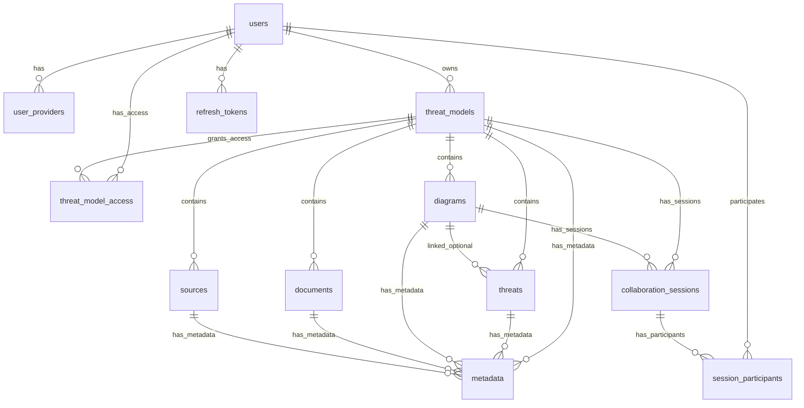

# PostgreSQL Database Schema Documentation

This document provides comprehensive documentation of the TMI (Threat Modeling Interface) application's PostgreSQL database schema, including entity relationships, data types, constraints, and migration history. The schema reflects 18 migrations and supports collaborative threat modeling with real-time features.

## Table of Contents

1. [Schema Overview](#schema-overview)
2. [Entity Relationship Diagram](#entity-relationship-diagram)
3. [Table Definitions](#table-definitions)
4. [Migration History](#migration-history)
5. [Relationships and Foreign Keys](#relationships-and-foreign-keys)
6. [Indexes and Performance Optimization](#indexes-and-performance-optimization)
7. [Constraints and Data Integrity](#constraints-and-data-integrity)
8. [Design Patterns](#design-patterns)

## Schema Overview

The TMI database schema supports a collaborative threat modeling platform with the following key features:

- **OAuth-based Authentication**: Multi-provider OAuth support (Google, GitHub, Microsoft, Apple, Facebook, Twitter)
- **Role-Based Access Control (RBAC)**: Granular permissions for threat models (owner, writer, reader)
- **Hierarchical Data Model**: Threat models contain threats, diagrams, documents, and source references
- **Real-time Collaboration**: WebSocket-based diagram collaboration with session management
- **Flexible Metadata System**: Key-value metadata for all entity types including cells
- **Audit Trail**: Complete timestamps and user tracking
- **Performance Optimization**: Comprehensive indexing strategy with 43 total indexes
- **Data Integrity**: Extensive foreign keys, CHECK constraints, and validation

### Core Entity Types

1. **Authentication**: `users`, `user_providers`, `refresh_tokens`
2. **Core Business Logic**: `threat_models`, `threat_model_access`, `threats`
3. **Sub-resources**: `diagrams`, `documents`, `sources`
4. **Extensibility**: `metadata` (supports all entity types)
5. **Collaboration**: `collaboration_sessions`, `session_participants`
6. **System**: `schema_migrations`

## Entity Relationship Diagram



## Table Definitions

### Authentication Tables

#### `users`

Core user profiles with OAuth authentication.

| Column      | Type        | Constraints                             | Description                 |
| ----------- | ----------- | --------------------------------------- | --------------------------- |
| id          | UUID        | PRIMARY KEY, DEFAULT uuid_generate_v4() | Unique user identifier      |
| email       | TEXT        | NOT NULL, UNIQUE                        | User email address          |
| name        | TEXT        | NOT NULL                                | User display name           |
| created_at  | TIMESTAMPTZ | NOT NULL, DEFAULT NOW()                 | Account creation time       |
| modified_at | TIMESTAMPTZ | NOT NULL, DEFAULT NOW()                 | Last profile update         |
| last_login  | TIMESTAMPTZ |                                         | Most recent login timestamp |

**Indexes:**

- `users_email_idx` (UNIQUE)
- `users_last_login_idx` (for analytics)

#### `user_providers`

OAuth provider linkage with support for multiple providers per user.

| Column           | Type        | Constraints                                      | Description                  |
| ---------------- | ----------- | ------------------------------------------------ | ---------------------------- |
| id               | UUID        | PRIMARY KEY, DEFAULT uuid_generate_v4()          | Unique link identifier       |
| user_id          | UUID        | NOT NULL, REFERENCES users(id) ON DELETE CASCADE | User reference               |
| provider         | TEXT        | NOT NULL, CHECK provider validation              | OAuth provider name          |
| provider_user_id | TEXT        | NOT NULL                                         | Provider-specific user ID    |
| provider_email   | TEXT        |                                                  | Email from provider          |
| provider_name    | TEXT        |                                                  | Name from provider           |
| is_primary       | BOOLEAN     | DEFAULT FALSE                                    | Primary provider designation |
| created_at       | TIMESTAMPTZ | NOT NULL, DEFAULT NOW()                          | Link creation time           |
| modified_at      | TIMESTAMPTZ | NOT NULL, DEFAULT NOW()                          | Last sync time               |

**Constraints:**

- `user_providers_user_id_provider_key` (UNIQUE user_id, provider)
- `user_providers_provider_provider_user_id_key` (UNIQUE provider, provider_user_id)
- `user_providers_unique_primary_per_user` (UNIQUE partial index on user_id WHERE is_primary = true)

**Supported Providers:** google, github, microsoft, apple, facebook, twitter

#### `refresh_tokens`

JWT refresh token management for secure session handling.

| Column     | Type        | Constraints                                      | Description         |
| ---------- | ----------- | ------------------------------------------------ | ------------------- |
| id         | UUID        | PRIMARY KEY, DEFAULT uuid_generate_v4()          | Token identifier    |
| user_id    | UUID        | NOT NULL, REFERENCES users(id) ON DELETE CASCADE | User reference      |
| token_hash | TEXT        | NOT NULL, UNIQUE                                 | Hashed token value  |
| expires_at | TIMESTAMPTZ | NOT NULL, CHECK expires_at > created_at          | Token expiry        |
| created_at | TIMESTAMPTZ | NOT NULL, DEFAULT NOW()                          | Token creation time |

### Core Business Tables

#### `threat_models`

Central entities representing threat modeling projects.

| Column                 | Type        | Constraints                                          | Description                |
| ---------------------- | ----------- | ---------------------------------------------------- | -------------------------- |
| id                     | UUID        | PRIMARY KEY, DEFAULT uuid_generate_v4()              | Unique model identifier    |
| name                   | TEXT        | NOT NULL, CHECK LENGTH > 0                           | Model name                 |
| description            | TEXT        |                                                      | Model description          |
| owner_email            | TEXT        | NOT NULL, REFERENCES users(email) ON DELETE RESTRICT | Current owner              |
| created_by             | TEXT        | NOT NULL                                             | Original creator email     |
| threat_model_framework | TEXT        | CHECK framework validation                           | Modeling framework         |
| issue_url              | TEXT        |                                                      | External issue tracker URL |
| document_count         | INTEGER     | NOT NULL DEFAULT 0                                   | Cached document count      |
| source_count           | INTEGER     | NOT NULL DEFAULT 0                                   | Cached source count        |
| diagram_count          | INTEGER     | NOT NULL DEFAULT 0                                   | Cached diagram count       |
| threat_count           | INTEGER     | NOT NULL DEFAULT 0                                   | Cached threat count        |
| created_at             | TIMESTAMPTZ | NOT NULL, DEFAULT NOW()                              | Creation time              |
| modified_at            | TIMESTAMPTZ | NOT NULL, DEFAULT NOW()                              | Last modification          |

**Supported Frameworks:** CIA, STRIDE, LINDDUN, DIE, PLOT4ai

#### `threat_model_access`

Role-based access control matrix for threat models.

| Column          | Type        | Constraints                                              | Description              |
| --------------- | ----------- | -------------------------------------------------------- | ------------------------ |
| id              | UUID        | PRIMARY KEY, DEFAULT uuid_generate_v4()                  | Access record identifier |
| threat_model_id | UUID        | NOT NULL, REFERENCES threat_models(id) ON DELETE CASCADE | Threat model reference   |
| user_email      | TEXT        | NOT NULL, REFERENCES users(email) ON DELETE CASCADE      | User reference           |
| role            | TEXT        | NOT NULL, CHECK role validation                          | Access role              |
| granted_by      | TEXT        | NOT NULL                                                 | Who granted access       |
| granted_at      | TIMESTAMPTZ | NOT NULL, DEFAULT NOW()                                  | When access was granted  |

**Constraints:**

- `threat_model_access_threat_model_id_user_email_key` (UNIQUE threat_model_id, user_email)

**Roles:** owner, writer, reader

#### `threats`

Individual security threats within threat models.

| Column          | Type        | Constraints                                              | Description             |
| --------------- | ----------- | -------------------------------------------------------- | ----------------------- |
| id              | UUID        | PRIMARY KEY, DEFAULT uuid_generate_v4()                  | Threat identifier       |
| threat_model_id | UUID        | NOT NULL, REFERENCES threat_models(id) ON DELETE CASCADE | Parent model            |
| diagram_id      | UUID        | REFERENCES diagrams(id) ON DELETE SET NULL               | Optional diagram link   |
| cell_id         | TEXT        |                                                          | Diagram cell identifier |
| name            | TEXT        | NOT NULL, CHECK LENGTH > 0                               | Threat name             |
| description     | TEXT        |                                                          | Detailed description    |
| impact          | TEXT        | CHECK severity validation                                | Impact level            |
| likelihood      | TEXT        | CHECK severity validation                                | Likelihood level        |
| risk_rating     | TEXT        | CHECK severity validation                                | Overall risk rating     |
| score           | INTEGER     | CHECK score >= 0 AND score <= 100                        | Numeric risk score      |
| priority        | TEXT        |                                                          | Priority classification |
| mitigated       | BOOLEAN     | DEFAULT FALSE                                            | Mitigation status       |
| status          | TEXT        |                                                          | Current threat status   |
| threat_type     | TEXT        |                                                          | Threat category         |
| issue_url       | TEXT        |                                                          | External tracker link   |
| created_at      | TIMESTAMPTZ | NOT NULL, DEFAULT NOW()                                  | Creation time           |
| modified_at     | TIMESTAMPTZ | NOT NULL, DEFAULT NOW()                                  | Last update             |

**Severity Levels:** Unknown, None, Low, Medium, High, Critical

### Sub-resource Tables

#### `diagrams`

Visual diagram storage with JSONB cell data.

| Column          | Type        | Constraints                                              | Description         |
| --------------- | ----------- | -------------------------------------------------------- | ------------------- |
| id              | UUID        | PRIMARY KEY, DEFAULT uuid_generate_v4()                  | Diagram identifier  |
| threat_model_id | UUID        | NOT NULL, REFERENCES threat_models(id) ON DELETE CASCADE | Parent model        |
| name            | TEXT        | NOT NULL, CHECK LENGTH > 0                               | Diagram name        |
| type            | TEXT        | NOT NULL, CHECK type = 'DFD-1.0.0'                       | Diagram type        |
| description     | TEXT        |                                                          | Diagram description |
| metadata        | JSONB       | DEFAULT '[]'::jsonb                                      | Metadata array      |
| cells           | JSONB       | DEFAULT '[]'::jsonb                                      | Diagram elements    |
| created_at      | TIMESTAMPTZ | NOT NULL, DEFAULT NOW()                                  | Creation time       |
| modified_at     | TIMESTAMPTZ | NOT NULL, DEFAULT NOW()                                  | Last modification   |

**Indexes:**

- GIN index on `metadata` for fast JSON queries
- GIN index on `cells` for diagram element searches

#### `documents`

Document references for threat models.

| Column          | Type        | Constraints                                              | Description          |
| --------------- | ----------- | -------------------------------------------------------- | -------------------- |
| id              | UUID        | PRIMARY KEY, DEFAULT uuid_generate_v4()                  | Document identifier  |
| threat_model_id | UUID        | NOT NULL, REFERENCES threat_models(id) ON DELETE CASCADE | Parent model         |
| name            | TEXT        | NOT NULL, CHECK LENGTH > 0                               | Document name        |
| url             | TEXT        | NOT NULL, CHECK LENGTH > 0                               | Document URL         |
| description     | TEXT        |                                                          | Document description |
| created_at      | TIMESTAMPTZ | NOT NULL, DEFAULT NOW()                                  | Creation time        |
| modified_at     | TIMESTAMPTZ | NOT NULL, DEFAULT NOW()                                  | Last update          |

#### `sources`

Source code repository references.

| Column          | Type        | Constraints                                              | Description              |
| --------------- | ----------- | -------------------------------------------------------- | ------------------------ |
| id              | UUID        | PRIMARY KEY, DEFAULT uuid_generate_v4()                  | Source identifier        |
| threat_model_id | UUID        | NOT NULL, REFERENCES threat_models(id) ON DELETE CASCADE | Parent model             |
| name            | TEXT        | NOT NULL, CHECK LENGTH > 0                               | Source name              |
| url             | TEXT        | NOT NULL, CHECK LENGTH > 0                               | Repository URL           |
| description     | TEXT        |                                                          | Source description       |
| type            | TEXT        | CHECK type validation                                    | Repository type          |
| parameters      | JSONB       |                                                          | Configuration parameters |
| created_at      | TIMESTAMPTZ | NOT NULL, DEFAULT NOW()                                  | Creation time            |
| modified_at     | TIMESTAMPTZ | NOT NULL, DEFAULT NOW()                                  | Last update              |

**Repository Types:** git, svn, mercurial, other

### Metadata System

#### `metadata`

Flexible key-value metadata for all entity types.

| Column      | Type        | Constraints                             | Description         |
| ----------- | ----------- | --------------------------------------- | ------------------- |
| id          | UUID        | PRIMARY KEY, DEFAULT uuid_generate_v4() | Metadata identifier |
| entity_type | TEXT        | NOT NULL, CHECK entity type validation  | Target entity type  |
| entity_id   | UUID        | NOT NULL                                | Target entity ID    |
| key         | TEXT        | NOT NULL, CHECK key format validation   | Metadata key        |
| value       | TEXT        | NOT NULL                                | Metadata value      |
| created_at  | TIMESTAMPTZ | NOT NULL, DEFAULT NOW()                 | Creation time       |
| modified_at | TIMESTAMPTZ | NOT NULL, DEFAULT NOW()                 | Last update         |

**Constraints:**

- `metadata_entity_type_entity_id_key_key` (UNIQUE entity_type, entity_id, key)

**Entity Types:** threat_model, threat, diagram, document, source, cell

**Key Format:** Alphanumeric characters, dashes, and underscores only (validated by regex)

### Collaboration Tables

#### `collaboration_sessions`

WebSocket collaboration session management.

| Column          | Type        | Constraints                                              | Description        |
| --------------- | ----------- | -------------------------------------------------------- | ------------------ |
| id              | UUID        | PRIMARY KEY, DEFAULT uuid_generate_v4()                  | Session identifier |
| threat_model_id | UUID        | NOT NULL, REFERENCES threat_models(id) ON DELETE CASCADE | Parent model       |
| diagram_id      | UUID        | REFERENCES diagrams(id) ON DELETE CASCADE                | Optional diagram   |
| websocket_url   | TEXT        | NOT NULL                                                 | WebSocket endpoint |
| expires_at      | TIMESTAMPTZ | CHECK expires_at > created_at                            | Optional expiry    |
| created_at      | TIMESTAMPTZ | NOT NULL, DEFAULT NOW()                                  | Session start      |
| modified_at     | TIMESTAMPTZ | NOT NULL, DEFAULT NOW()                                  | Last activity      |

#### `session_participants`

Collaboration session participant tracking.

| Column     | Type        | Constraints                                                       | Description              |
| ---------- | ----------- | ----------------------------------------------------------------- | ------------------------ |
| id         | UUID        | PRIMARY KEY, DEFAULT uuid_generate_v4()                           | Participation identifier |
| session_id | UUID        | NOT NULL, REFERENCES collaboration_sessions(id) ON DELETE CASCADE | Session reference        |
| user_id    | UUID        | NOT NULL, REFERENCES users(id) ON DELETE CASCADE                  | Participant              |
| joined_at  | TIMESTAMPTZ | NOT NULL, DEFAULT NOW()                                           | Join time                |
| left_at    | TIMESTAMPTZ |                                                                   | Leave time               |

**Constraints:**

- `session_participants_unique_active` (UNIQUE session_id, user_id WHERE left_at IS NULL)

## Migration History

The database schema has evolved through 18 migrations:

| Migration | Description                          | Key Changes                                          |
| --------- | ------------------------------------ | ---------------------------------------------------- |
| 001       | Create users table                   | Basic user profile structure                         |
| 002       | Create user_providers table          | OAuth provider linking                               |
| 003       | Create threat_models table           | Core business entity                                 |
| 004       | Create threat_model_access table     | Role-based access control                            |
| 005       | Create threats table                 | Individual threat storage                            |
| 006       | Create diagrams table                | Diagram management                                   |
| 007       | Create refresh_tokens table          | JWT session management                               |
| 008       | Add additional constraints           | Performance and data integrity                       |
| 009       | Update threat_models schema          | Framework and issue tracking                         |
| 010       | Update threats schema                | Enhanced threat fields (score, priority, mitigation) |
| 011       | Create documents table               | Document reference sub-resources                     |
| 012       | Create sources table                 | Source repository sub-resources                      |
| 013       | Create metadata table                | Flexible key-value metadata system                   |
| 014       | Update diagrams schema               | JSONB cells for modern diagram storage               |
| 015       | Create collaboration sessions        | Real-time collaboration support                      |
| 016       | Add sub-resource performance indexes | Comprehensive indexing strategy                      |
| 017       | Enhance metadata table               | Improved constraints and cell support                |
| 018       | Add count fields to threat_models    | Performance optimization for counts                  |

## Relationships and Foreign Keys

### Cascade Deletion Policies

- **CASCADE DELETE**: All dependent entities are removed

  - `user_providers` → `users`
  - `refresh_tokens` → `users`
  - `threat_model_access` → `threat_models` and `users`
  - All sub-resources → `threat_models`
  - `collaboration_sessions` → `threat_models` and `diagrams`
  - `session_participants` → `collaboration_sessions` and `users`

- **RESTRICT DELETE**: Prevents deletion if dependencies exist

  - `threat_models` → `users` (owner_email)

- **SET NULL**: Removes reference but preserves entity
  - `threats` → `diagrams` (optional relationship)

### Referential Integrity

- All UUID foreign keys use proper references with appropriate cascade policies
- Email-based references (owner_email) use RESTRICT to prevent orphaned models
- Optional relationships use SET NULL to maintain data integrity

## Indexes and Performance Optimization

The schema includes 43 strategically placed indexes for optimal performance:

### Primary Indexes

- All tables have UUID primary key indexes
- Unique constraints on email, tokens, and key relationships

### Performance Indexes (Migration 16)

- **Sub-resource queries**: Composite indexes on `threat_model_id + created_at/modified_at`
- **Pagination optimization**: INCLUDE indexes for common column combinations
- **Authorization queries**: Indexes on `threat_model_id` and `user_email` combinations
- **Metadata queries**: Partial indexes for each entity type

### JSONB Indexes

- GIN indexes on `diagrams.metadata` and `diagrams.cells` for fast JSON queries
- GIN indexes on `sources.parameters` for configuration searches

### Example Index Strategies

```sql
-- Efficient sub-resource pagination
CREATE INDEX idx_threats_threat_model_id_created_at
ON threats (threat_model_id, created_at);

-- Metadata queries by entity type
CREATE INDEX idx_metadata_threat_model
ON metadata (entity_id) WHERE entity_type = 'threat_model';

-- Authorization inheritance
CREATE INDEX idx_threat_model_access_threat_model_id
ON threat_model_access (threat_model_id);
```

## Constraints and Data Integrity

### CHECK Constraints

#### Enum Validation

- **Providers**: google, github, microsoft, apple, facebook, twitter
- **Roles**: owner, writer, reader
- **Frameworks**: CIA, STRIDE, LINDDUN, DIE, PLOT4ai
- **Repository Types**: git, svn, mercurial, other
- **Entity Types**: threat_model, threat, diagram, document, source, cell
- **Severity Levels**: Unknown, None, Low, Medium, High, Critical

#### Data Validation

- Non-empty string validation: `CHECK (LENGTH(name) > 0)`
- Score range validation: `CHECK (score >= 0 AND score <= 100)`
- Time validation: `CHECK (expires_at > created_at)`
- Metadata key format: `CHECK (key ~ '^[a-zA-Z0-9_-]+$')`
- Diagram type constraint: `CHECK (type = 'DFD-1.0.0')`

#### Unique Constraints

- Single primary provider per user
- Unique user-provider combinations
- Unique access role per user per threat model
- Unique metadata key per entity
- Unique active session participation

## Design Patterns

### Hierarchical Authorization

- Threat models control access to all sub-resources
- Role inheritance: readers can read, writers can read/write, owners can manage
- Email-based ownership with UUID-based relationships

### Audit Trail Pattern

- All entities include `created_at` and `modified_at` timestamps
- Original creator tracking (`created_by`, `granted_by`)
- Soft deletion through status fields where appropriate

### Extensibility Pattern

- JSONB columns for flexible data (`metadata`, `cells`, `parameters`)
- Generic metadata table supporting all entity types
- Version-controlled schema through migrations

### Performance Pattern

- Count field caching to avoid expensive aggregate queries
- Strategic indexing for common query patterns
- Composite indexes for multi-column queries
- Partial indexes for filtered queries

### Collaboration Pattern

- Session-based collaboration with participant tracking
- WebSocket URL management
- Optional session expiry with validation

This comprehensive schema supports a scalable, secure, and feature-rich collaborative threat modeling platform with real-time capabilities and extensive performance optimization.
