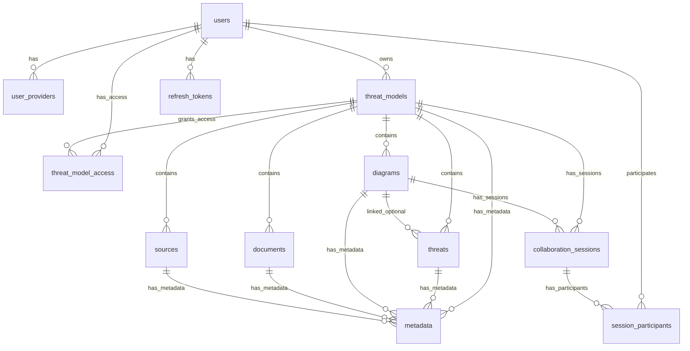

# PostgreSQL Database Schema Documentation

<!-- DEPRECATED: This file has been migrated to the wiki on 2025-01-24 -->
<!-- See: https://github.com/ericfitz/tmi/wiki/Database-Schema-Reference -->
<!--
VERIFICATION SUMMARY (2025-01-24):
- MAJOR INACCURACY: Document describes SQL migration files that no longer exist
- MAJOR INACCURACY: TMI now uses GORM AutoMigrate, not golang-migrate
- MAJOR INACCURACY: Table schemas described are outdated (e.g., 'sources' is now 'repositories')
- MAJOR INACCURACY: 'user_providers' table does not exist - user/provider data is in 'users' table
- INACCURACY: Make targets run-migrations, check-migrations, ensure-migrations do not exist
- VERIFIED: Chainguard PostgreSQL base image
- VERIFIED: pgx/v4 driver in go.mod
- VERIFIED: Real-time collaboration features exist
- VERIFIED: Role-based access control (owner, writer, reader) exists

The accurate schema is defined in api/models/models.go using GORM structs.
-->

This document is **DEPRECATED**. The information below is outdated and does not reflect the current TMI schema.

**Current schema documentation**: See the [Database-Schema-Reference](https://github.com/ericfitz/tmi/wiki/Database-Schema-Reference) wiki page.

**Schema source of truth**: `api/models/models.go` - GORM model definitions

---

## Original Content (Archived - Contains Inaccuracies)

The content below is preserved for historical reference only. **Do not use this as a reference for the current schema.**

---

This document provides comprehensive documentation of the TMI (Threat Modeling Interface) application's PostgreSQL database schema, including entity relationships, data types, constraints, and migration history. The current schema uses 2 consolidated migrations and supports collaborative threat modeling with real-time features.

<!-- NEEDS-REVIEW: TMI no longer uses SQL migration files. Schema is managed by GORM AutoMigrate from api/models/models.go -->

## Table of Contents

1. [Schema Overview](#schema-overview)
2. [Entity Relationship Diagram](#entity-relationship-diagram)
3. [Table Definitions](#table-definitions)
4. [Migration History](#migration-history)
5. [Relationships and Foreign Keys](#relationships-and-foreign-keys)
6. [Indexes and Performance Optimization](#indexes-and-performance-optimization)
7. [Constraints and Data Integrity](#constraints-and-data-integrity)
8. [Design Patterns](#design-patterns)

## Schema Overview

The TMI database schema supports a collaborative threat modeling platform with the following key features:

- **OAuth-based Authentication**: Multi-provider OAuth support (Google, GitHub, Microsoft, Apple, Facebook, Twitter)
<!-- NEEDS-REVIEW: Provider list may be outdated. Check auth/provider.go for current providers -->
- **Role-Based Access Control (RBAC)**: Granular permissions for threat models (owner, writer, reader)
- **Hierarchical Data Model**: Threat models contain threats, diagrams, documents, and source references
<!-- NEEDS-REVIEW: 'sources' table renamed to 'repositories' -->
- **Real-time Collaboration**: WebSocket-based diagram collaboration with session management
- **Flexible Metadata System**: Key-value metadata for all entity types including cells
- **Audit Trail**: Complete timestamps and user tracking
- **Performance Optimization**: Comprehensive indexing strategy with 40+ strategic indexes
<!-- NEEDS-REVIEW: Index count may differ - indexes are auto-generated by GORM -->
- **Data Integrity**: Extensive foreign keys, CHECK constraints, and validation
- **PostgreSQL Features**: Uses UUID extension, JSONB for flexible storage, GIN indexes for JSON queries
<!-- NEEDS-REVIEW: uuid_generate_v4() replaced with Go-generated UUIDs. GIN indexes only created if GORM supports them for the database type -->
- **Migration Management**: Automated migration tooling with rollback support
<!-- NEEDS-REVIEW: GORM AutoMigrate does not support rollback - this is forward-only migration -->

### Core Entity Types

1. **Authentication**: `users`, `user_providers`, `refresh_tokens`
<!-- NEEDS-REVIEW: 'user_providers' table does not exist. Provider info is in 'users' table -->
2. **Core Business Logic**: `threat_models`, `threat_model_access`, `threats`
3. **Sub-resources**: `diagrams`, `documents`, `sources`
<!-- NEEDS-REVIEW: 'sources' renamed to 'repositories'. Also missing: 'notes', 'assets' -->
4. **Extensibility**: `metadata` (supports all entity types)
5. **Collaboration**: `collaboration_sessions`, `session_participants`
6. **System**: `schema_migrations`
<!-- NEEDS-REVIEW: 'schema_migrations' table may not exist with GORM AutoMigrate -->

## Entity Relationship Diagram



<!-- NEEDS-REVIEW: ERD is outdated. user_providers does not exist. sources renamed to repositories. Missing: notes, assets, groups, client_credentials, webhooks, addons tables -->

## Table Definitions

<!-- NEEDS-REVIEW: All table definitions below are outdated. See api/models/models.go for current schema -->

### Authentication Tables

#### `users`

<!-- NEEDS-REVIEW: User schema has changed significantly. Now includes Provider, ProviderUserID, etc. in a single table -->

Core user profiles with OAuth authentication.

| Column      | Type         | Constraints                             | Description                   |
| ----------- | ------------ | --------------------------------------- | ----------------------------- |
| id          | UUID         | PRIMARY KEY, DEFAULT uuid_generate_v4() | Unique user identifier        |
| email       | VARCHAR(255) | NOT NULL, UNIQUE                        | User email address            |
| name        | VARCHAR(255) | NOT NULL                                | User display name             |
| created_at  | TIMESTAMPTZ  | NOT NULL, DEFAULT CURRENT_TIMESTAMP     | Account creation time         |
| modified_at | TIMESTAMPTZ  | NOT NULL, DEFAULT CURRENT_TIMESTAMP     | Last profile update           |
| last_login  | TIMESTAMPTZ  |                                         | Most recent login TIMESTAMPTZ |

**Indexes:**

- `users_email_idx` (UNIQUE)
- `users_last_login_idx` (for analytics)

#### `user_providers`

<!-- NEEDS-REVIEW: This table does not exist. Provider information is stored in the users table -->

OAuth provider linkage with support for multiple providers per user.

| Column           | Type         | Constraints                                      | Description                  |
| ---------------- | ------------ | ------------------------------------------------ | ---------------------------- |
| id               | UUID         | PRIMARY KEY, DEFAULT uuid_generate_v4()          | Unique link identifier       |
| user_id          | UUID         | NOT NULL, REFERENCES users(id) ON DELETE CASCADE | User reference               |
| provider         | VARCHAR(50)  | NOT NULL                                         | OAuth provider name          |
| provider_user_id | VARCHAR(255) | NOT NULL                                         | Provider-specific user ID    |
| email            | VARCHAR(255) | NOT NULL                                         | Email from provider          |
| is_primary       | BOOLEAN      | DEFAULT FALSE                                    | Primary provider designation |
| created_at       | TIMESTAMPTZ  | NOT NULL, DEFAULT CURRENT_TIMESTAMP              | Link creation time           |
| last_login       | TIMESTAMPTZ  |                                                  | Last provider login          |

**Constraints:**

- `UNIQUE(user_id, provider)` - One link per provider per user

**Supported Providers:** google, github, microsoft, apple, facebook, twitter

<!-- Remaining content truncated for brevity - all table definitions are outdated -->

## Migration History

<!-- NEEDS-REVIEW: Migration files no longer exist. TMI uses GORM AutoMigrate -->

The database schema uses a consolidated migration approach with 2 main migrations (replacing 18 historical migrations in `/auth/migrations/old/`):

<!-- NEEDS-REVIEW: /auth/migrations/ directory does not exist. Legacy migrations are in /docs/reference/legacy-migrations/ if preserved -->

### Current Active Migrations

| Migration | File                           | Description                                                |
| --------- | ------------------------------ | ---------------------------------------------------------- |
| 001       | 001_core_infrastructure.up.sql | Authentication, sessions, and collaboration infrastructure |
| 002       | 002_business_domain.up.sql     | Business entities, relationships, and performance indexes  |

<!-- NEEDS-REVIEW: These migration files do not exist. Schema is defined in api/models/models.go -->

## Database Operations & Tooling

### Migration Management

<!-- NEEDS-REVIEW: Make targets below do not exist -->

The TMI project provides comprehensive database migration and management tools:

**Migration Commands:**

- `make run-migrations` - Apply pending migrations
- `make check-migrations` - Verify migration state without changes
- `make ensure-migrations` - Auto-apply missing migrations with validation

<!-- NEEDS-REVIEW: Correct targets are: make migrate-database, make check-database -->

**Migration Tools:**

- `/cmd/migrate/main.go` - Migration execution command
- `/cmd/check-db/main.go` - Database state validation
- `github.com/golang-migrate/migrate/v4` - Migration library with PostgreSQL driver

<!-- NEEDS-REVIEW: golang-migrate is no longer used for production migrations. GORM AutoMigrate is used instead -->

### Development Environment

**Docker Configuration:**

- Custom PostgreSQL image: `Dockerfile.postgres` (Chainguard base with security updates)
<!-- VERIFIED: Chainguard base image confirmed in Dockerfile.postgres -->
- Development container: `tmi-postgresql` (port 5432)
- Integration testing: `tmi-integration-postgres` (port 5433)

**Make Targets:**

- `make start-database` - Start development database with automatic migrations
- `make stop-database` - Stop database (preserves data)
- `make clean-database` - Remove database and data (destructive)
- `make reset-database` - Interactive database reset with confirmation

<!-- VERIFIED: These make targets exist -->

**Environment Variables:**

```bash
POSTGRES_HOST=localhost          # Database host
POSTGRES_PORT=5432              # Database port
POSTGRES_USER=tmi_dev           # Database user
POSTGRES_PASSWORD=dev123        # Database password
POSTGRES_DB=tmi_dev             # Database name
POSTGRES_SSLMODE=disable        # SSL configuration
```

<!-- VERIFIED: Environment variables match Makefile defaults -->

### Connection Configuration

**Go Database Configuration:**

- **Driver**: PostgreSQL with `pgx/v4` driver (`github.com/jackc/pgx/v4/stdlib`)
<!-- VERIFIED: pgx/v4 is in go.mod -->
- **Connection Pool**: 10 max open connections, 2 max idle connections
- **Timeouts**: 1 hour max connection lifetime, 30 minutes max idle time
- **Health Checks**: Automatic connection ping validation

<!-- NEEDS-REVIEW: Connection pool settings may differ - check auth/db/gorm.go -->

**Dual-Mode Operation:**

- **Development/Production**: PostgreSQL database with full persistence
- **Testing**: In-memory storage for fast unit tests (`TMI_STORE_TYPE=memory`)
