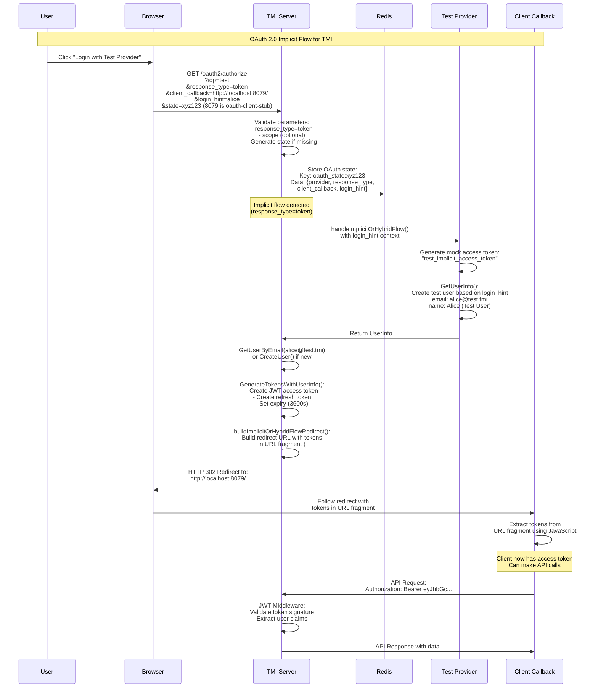

# OAuth 2.0 Implicit Flow - TMI Implementation

## Swim Lane Diagram



## Key Components

### 1. **User/Browser**

- Initiates login flow
- Follows redirects
- Receives tokens in URL fragment

### 2. **TMI Server (auth/handlers.go)**

- **Authorize Handler** (line 168-303): Entry point for OAuth flow
  - Validates `response_type` parameter
  - Stores state in Redis
  - Detects implicit flow when `response_type=token`
  - Calls `handleImplicitOrHybridFlow()` for non-code flows

### 3. **Redis Store**

- Stores OAuth state temporarily (10 minutes)
- Contains: provider, response_type, client_callback, login_hint

### 4. **Test Provider (auth/test_provider.go)**

- **handleImplicitOrHybridFlow()** (line 1359-1464):
  - Generates mock access token for testing
  - Creates/retrieves user based on login_hint
  - Generates TMI JWT tokens
  - Builds redirect URL with tokens in fragment

### 5. **Client Application**

- Receives tokens in URL fragment (after # symbol)
- Extracts tokens using JavaScript (fragments aren't sent to server)
- Uses access token for API calls

## Flow Characteristics

### Implicit Flow Features:

- **No authorization code exchange** - tokens returned directly
- **Tokens in URL fragment** (#) not query parameters (?)
- **No client secret needed** - suitable for SPAs
- **Short-lived tokens** - 3600 seconds (1 hour)
- **No refresh token in pure implicit flow** (security best practice)

### TMI-Specific Implementation:

1. **Test Provider Support**: Special handling for `idp=test` with predictable users via `login_hint`
2. **State Management**: Redis-backed state storage for CSRF protection
3. **JWT Generation**: TMI generates its own JWT tokens after validating with provider
4. **User Creation**: Automatic user creation if email doesn't exist
5. **Fragment Building**: Proper URL fragment construction for token delivery

## Security Considerations

1. **Tokens exposed in URL** - Can appear in browser history, logs
2. **No refresh tokens** - Reduces risk of token theft
3. **State parameter** - Prevents CSRF attacks
4. **Short token lifetime** - 1 hour expiry limits exposure
5. **HTTPS required in production** - Prevents token interception

## Supported Response Types

The TMI implementation supports multiple OAuth flows (auth/handlers.go line 1342-1356):

- `code` - Authorization Code Flow
- `token` - Implicit Flow (Access Token)
- `id_token` - Implicit Flow (ID Token)
- `code token` - Hybrid Flow
- `code id_token` - Hybrid Flow
- `code id_token token` - Hybrid Flow

## Testing the Flow

```bash
# Start OAuth callback stub
make oauth-stub-start

# Initiate implicit flow with test provider
curl "http://localhost:8080/oauth2/authorize?idp=test&response_type=token&login_hint=alice&client_callback=http://localhost:8079/"

# The stub will receive tokens in URL fragment
# Check the captured tokens
curl http://localhost:8079/latest
```
