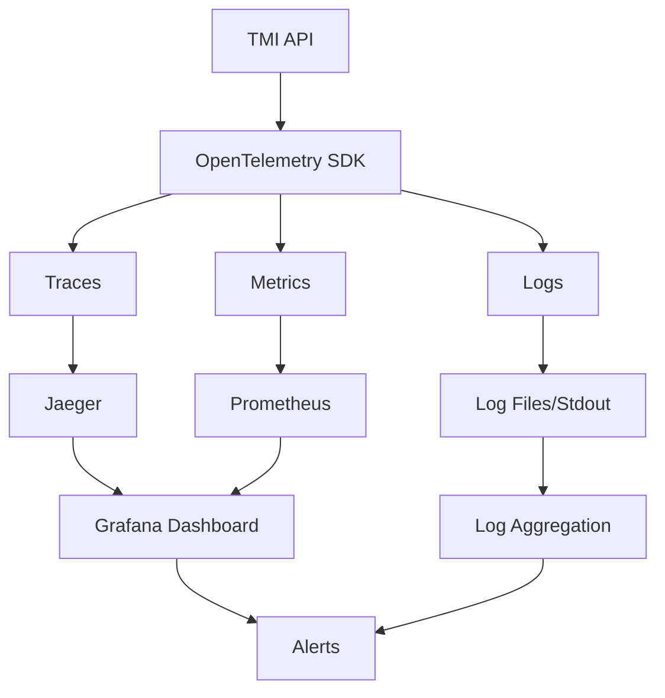

# TMI Observability Guide

This guide provides comprehensive information about the observability implementation in the TMI (Threat Modeling Interface) application using OpenTelemetry.

## Table of Contents

1. [Overview](#overview)
2. [Architecture](#architecture)
3. [Components](#components)
4. [Getting Started](#getting-started)
5. [Configuration](#configuration)
6. [Monitoring & Alerting](#monitoring--alerting)
7. [Troubleshooting](#troubleshooting)
8. [Runbooks](#runbooks)
9. [Performance Tuning](#performance-tuning)
10. [Security Considerations](#security-considerations)

## Overview

The TMI application implements comprehensive observability using OpenTelemetry, providing:

- **Distributed Tracing**: End-to-end request tracing across all services
- **Metrics Collection**: Application and infrastructure metrics
- **Structured Logging**: Correlated logs with trace context
- **Security Filtering**: PII and sensitive data protection
- **Performance Monitoring**: Real-time performance insights

## Architecture



### Key Components

- **OpenTelemetry SDK**: Core instrumentation library
- **Jaeger**: Distributed tracing backend
- **Prometheus**: Metrics collection and storage
- **Grafana**: Visualization and dashboards
- **Log Aggregation**: Centralized log management

## Components

### 1. Tracing Components

#### HTTP Tracing
- Automatic HTTP request/response tracing
- Request correlation across service boundaries
- Performance metrics per endpoint

#### Database Tracing
- SQL query tracing with sanitization
- Connection pool monitoring
- Transaction lifecycle tracking

#### Redis Tracing
- Cache operation tracing
- Hit/miss ratio tracking
- Performance optimization insights

#### WebSocket Tracing
- Real-time collaboration session tracking
- Message flow tracing
- Connection lifecycle monitoring

### 2. Metrics Components

#### HTTP Metrics
- Request duration, rate, and error rate
- Response size distribution
- User activity patterns

#### Database Metrics
- Query performance and slow query detection
- Connection pool utilization
- Transaction success/failure rates

#### Redis Metrics
- Cache hit/miss ratios
- Operation latency
- Memory usage tracking

#### Business Metrics
- Threat model operations
- User collaboration patterns
- API usage analytics

#### System Metrics
- Go runtime metrics
- Memory and CPU utilization
- Process-level statistics

### 3. Logging Components

#### Structured Logging
- JSON-formatted logs with trace correlation
- Contextual attributes
- Security filtering

#### Log Sampling
- Intelligent sampling to reduce overhead
- Adaptive sampling based on system load
- Context-aware sampling decisions

#### Security Filtering
- PII detection and redaction
- Token and credential filtering
- SQL query sanitization

## Getting Started

### Prerequisites

- Go 1.21+
- Docker and Docker Compose
- Kubernetes (for production deployment)

### Local Development Setup

1. **Start the observability stack:**
```bash
cd deployments/docker
docker-compose -f docker-compose.dev.yml up -d
```

2. **Set environment variables:**
```bash
export OTEL_ENVIRONMENT=development
export OTEL_TRACING_ENABLED=true
export OTEL_METRICS_ENABLED=true
export OTEL_CONSOLE_EXPORTER=true
```

3. **Run the application:**
```bash
make start-dev
```

4. **Access the observability tools:**
- Jaeger UI: http://localhost:16686
- Prometheus: http://localhost:9090
- Grafana: http://localhost:3000 (admin/admin)

### Production Deployment

See the [Deployment Guide](deployment.md) for detailed production setup instructions.

## Configuration

### Environment Variables

The application uses environment variables for configuration. See [Configuration Reference](configuration.md) for complete details.

#### Key Configuration Options

```bash
# Service Identification
OTEL_SERVICE_NAME=tmi-api
OTEL_SERVICE_VERSION=1.0.0
OTEL_ENVIRONMENT=production

# Tracing Configuration
OTEL_TRACING_ENABLED=true
OTEL_TRACING_SAMPLE_RATE=0.1

# Metrics Configuration
OTEL_METRICS_ENABLED=true
OTEL_METRICS_INTERVAL=30s

# Exporter Configuration
OTEL_EXPORTER_TYPE=otlp
OTEL_EXPORTER_OTLP_ENDPOINT=http://jaeger:4318
```

### Performance Profiles

Choose a performance profile based on your environment:

- **Low**: Minimal resource usage, higher latency
- **Medium**: Balanced performance (recommended)
- **High**: Maximum performance, higher resource usage
- **Custom**: Manual configuration

```bash
OTEL_PERFORMANCE_PROFILE=medium
```

## Monitoring & Alerting

### Key Metrics to Monitor

1. **Application Health**
   - HTTP error rates (4xx, 5xx)
   - Response time percentiles (p50, p95, p99)
   - Request throughput

2. **Database Performance**
   - Query duration
   - Connection pool utilization
   - Slow query count

3. **Cache Performance**
   - Hit/miss ratios
   - Operation latency
   - Memory usage

4. **System Resources**
   - CPU utilization
   - Memory usage
   - Goroutine count

### Sample Prometheus Queries

```promql
# HTTP error rate
rate(http_requests_total{status=~"5.."}[5m])

# 95th percentile response time
histogram_quantile(0.95, rate(http_request_duration_seconds_bucket[5m]))

# Database connection pool utilization
postgres_connections_active / postgres_connections_max

# Cache hit rate
rate(redis_cache_hits_total[5m]) / rate(redis_cache_operations_total[5m])
```

### Grafana Dashboards

Pre-built dashboards are available in `/docs/observability/dashboards/`:

- **TMI Overview**: High-level application metrics
- **HTTP Performance**: Request/response analysis
- **Database Performance**: SQL query insights
- **System Resources**: Infrastructure monitoring

## Troubleshooting

### Common Issues

#### High Memory Usage
```bash
# Check memory metrics
curl http://localhost:8080/metrics | grep go_memstats

# Adjust batch sizes
OTEL_TRACING_BATCH_SIZE=256
OTEL_METRICS_BATCH_SIZE=512
```

#### Missing Traces
```bash
# Verify sampling rate
echo $OTEL_TRACING_SAMPLE_RATE

# Check exporter configuration
echo $OTEL_EXPORTER_OTLP_ENDPOINT

# Verify Jaeger connectivity
curl http://jaeger:14268/api/traces
```

#### Log Volume Issues
```bash
# Enable log sampling
OTEL_ENABLE_LOG_SAMPLING=true

# Adjust log level
LOG_LEVEL=warn

# Configure log rotation
LOG_ROTATION_MAX_SIZE=100
LOG_ROTATION_MAX_BACKUPS=10
```

## Runbooks

Detailed operational runbooks are available:

- [Incident Response](runbooks/incident-response.md)
- [Performance Issues](runbooks/performance-issues.md)
- [Database Problems](runbooks/database-issues.md)
- [Cache Issues](runbooks/cache-issues.md)
- [Security Incidents](runbooks/security-incidents.md)

## Performance Tuning

### Sampling Configuration

Adjust sampling rates based on traffic volume:

```bash
# Development (sample everything)
OTEL_TRACING_SAMPLE_RATE=1.0

# Staging (50% sampling)
OTEL_TRACING_SAMPLE_RATE=0.5

# Production (10% sampling)
OTEL_TRACING_SAMPLE_RATE=0.1
```

### Batch Processing

Optimize batch sizes for your workload:

```bash
# High throughput
OTEL_TRACING_BATCH_SIZE=2048
OTEL_METRICS_BATCH_SIZE=4096

# Low resource usage
OTEL_TRACING_BATCH_SIZE=128
OTEL_METRICS_BATCH_SIZE=256
```

### Memory Management

Configure memory limits:

```bash
# Maximum memory usage (MB)
OTEL_MAX_MEMORY_MB=512

# Queue sizes
OTEL_TRACING_QUEUE_SIZE=2048
OTEL_METRICS_QUEUE_SIZE=4096
```

## Security Considerations

### Data Protection

The observability system implements security filtering to protect sensitive data:

- **PII Detection**: Automatic detection and redaction
- **Token Filtering**: JWT and API key sanitization
- **SQL Sanitization**: Query parameter scrubbing
- **URL Filtering**: Sensitive query parameter removal

### Configuration

```bash
# Enable security filtering
OTEL_ENABLE_SECURITY_FILTERING=true

# Configure TLS
OTEL_TLS_ENABLED=true
OTEL_TLS_CERT_FILE=/path/to/cert.pem
OTEL_TLS_KEY_FILE=/path/to/key.pem
```

### Access Control

- Restrict access to observability endpoints
- Use authentication for Grafana dashboards
- Implement network policies in Kubernetes
- Monitor access logs for anomalies

## Best Practices

1. **Start with Conservative Sampling**: Begin with low sampling rates in production
2. **Monitor Resource Usage**: Track memory and CPU consumption
3. **Use Structured Logging**: Leverage JSON format for better searchability
4. **Implement Alerting**: Set up proactive monitoring alerts
5. **Regular Review**: Periodically review and optimize configuration
6. **Security First**: Always enable security filtering in production
7. **Document Changes**: Maintain operational documentation
8. **Test Thoroughly**: Validate observability in staging environments

## Support

For issues and questions:

1. Check the [troubleshooting guide](troubleshooting.md)
2. Review the [runbooks](runbooks/)
3. Monitor application logs for errors
4. Contact the development team

## Contributing

See [CONTRIBUTING.md](../CONTRIBUTING.md) for guidelines on contributing to the observability implementation.

## References

- [OpenTelemetry Documentation](https://opentelemetry.io/docs/)
- [Jaeger Documentation](https://www.jaegertracing.io/docs/)
- [Prometheus Documentation](https://prometheus.io/docs/)
- [Grafana Documentation](https://grafana.com/docs/)