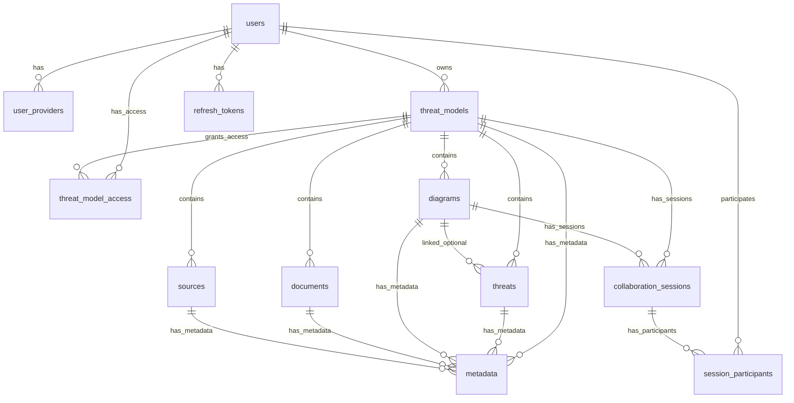

# PostgreSQL Database Schema Documentation

This document provides comprehensive documentation of the TMI (Threat Modeling Interface) application's PostgreSQL database schema, including entity relationships, data types, constraints, and migration history. The current schema uses 2 consolidated migrations and supports collaborative threat modeling with real-time features.

## Table of Contents

1. [Schema Overview](#schema-overview)
2. [Entity Relationship Diagram](#entity-relationship-diagram)
3. [Table Definitions](#table-definitions)
4. [Migration History](#migration-history)
5. [Relationships and Foreign Keys](#relationships-and-foreign-keys)
6. [Indexes and Performance Optimization](#indexes-and-performance-optimization)
7. [Constraints and Data Integrity](#constraints-and-data-integrity)
8. [Design Patterns](#design-patterns)

## Schema Overview

The TMI database schema supports a collaborative threat modeling platform with the following key features:

- **OAuth-based Authentication**: Multi-provider OAuth support (Google, GitHub, Microsoft, Apple, Facebook, Twitter)
- **Role-Based Access Control (RBAC)**: Granular permissions for threat models (owner, writer, reader)
- **Hierarchical Data Model**: Threat models contain threats, diagrams, documents, and source references
- **Real-time Collaboration**: WebSocket-based diagram collaboration with session management
- **Flexible Metadata System**: Key-value metadata for all entity types including cells
- **Audit Trail**: Complete timestamps and user tracking
- **Performance Optimization**: Comprehensive indexing strategy with 40+ strategic indexes
- **Data Integrity**: Extensive foreign keys, CHECK constraints, and validation
- **PostgreSQL Features**: Uses UUID extension, JSONB for flexible storage, GIN indexes for JSON queries
- **Migration Management**: Automated migration tooling with rollback support

### Core Entity Types

1. **Authentication**: `users`, `user_providers`, `refresh_tokens`
2. **Core Business Logic**: `threat_models`, `threat_model_access`, `threats`
3. **Sub-resources**: `diagrams`, `documents`, `sources`
4. **Extensibility**: `metadata` (supports all entity types)
5. **Collaboration**: `collaboration_sessions`, `session_participants`
6. **System**: `schema_migrations`

## Entity Relationship Diagram



## Table Definitions

### Authentication Tables

#### `users`

Core user profiles with OAuth authentication.

| Column      | Type         | Constraints                             | Description                   |
| ----------- | ------------ | --------------------------------------- | ----------------------------- |
| id          | UUID         | PRIMARY KEY, DEFAULT uuid_generate_v4() | Unique user identifier        |
| email       | VARCHAR(255) | NOT NULL, UNIQUE                        | User email address            |
| name        | VARCHAR(255) | NOT NULL                                | User display name             |
| created_at  | TIMESTAMPTZ  | NOT NULL, DEFAULT CURRENT_TIMESTAMP     | Account creation time         |
| modified_at | TIMESTAMPTZ  | NOT NULL, DEFAULT CURRENT_TIMESTAMP     | Last profile update           |
| last_login  | TIMESTAMPTZ  |                                         | Most recent login TIMESTAMPTZ |

**Indexes:**

- `users_email_idx` (UNIQUE)
- `users_last_login_idx` (for analytics)

#### `user_providers`

OAuth provider linkage with support for multiple providers per user.

| Column           | Type         | Constraints                                      | Description                  |
| ---------------- | ------------ | ------------------------------------------------ | ---------------------------- |
| id               | UUID         | PRIMARY KEY, DEFAULT uuid_generate_v4()          | Unique link identifier       |
| user_id          | UUID         | NOT NULL, REFERENCES users(id) ON DELETE CASCADE | User reference               |
| provider         | VARCHAR(50)  | NOT NULL                                         | OAuth provider name          |
| provider_user_id | VARCHAR(255) | NOT NULL                                         | Provider-specific user ID    |
| email            | VARCHAR(255) | NOT NULL                                         | Email from provider          |
| is_primary       | BOOLEAN      | DEFAULT FALSE                                    | Primary provider designation |
| created_at       | TIMESTAMPTZ  | NOT NULL, DEFAULT CURRENT_TIMESTAMP              | Link creation time           |
| last_login       | TIMESTAMPTZ  |                                                  | Last provider login          |

**Constraints:**

- `UNIQUE(user_id, provider)` - One link per provider per user

**Supported Providers:** google, github, microsoft, apple, facebook, twitter

#### `refresh_tokens`

JWT refresh token management for secure session handling.

| Column     | Type         | Constraints                                      | Description         |
| ---------- | ------------ | ------------------------------------------------ | ------------------- |
| id         | UUID         | PRIMARY KEY, DEFAULT uuid_generate_v4()          | Token identifier    |
| user_id    | UUID         | NOT NULL, REFERENCES users(id) ON DELETE CASCADE | User reference      |
| token      | VARCHAR(255) | NOT NULL, UNIQUE                                 | Token value         |
| expires_at | TIMESTAMPTZ  | NOT NULL                                         | Token expiry        |
| created_at | TIMESTAMPTZ  | NOT NULL, DEFAULT CURRENT_TIMESTAMP              | Token creation time |

### Core Business Tables

#### `threat_models`

Central entities representing threat modeling projects.

| Column                 | Type          | Constraints                                           | Description                |
| ---------------------- | ------------- | ----------------------------------------------------- | -------------------------- |
| id                     | UUID          | PRIMARY KEY, DEFAULT uuid_generate_v4()               | Unique model identifier    |
| owner_email            | VARCHAR(255)  | NOT NULL, REFERENCES users(email) ON DELETE RESTRICT  | Current owner              |
| name                   | VARCHAR(255)  | NOT NULL                                              | Model name                 |
| description            | TEXT          |                                                       | Model description          |
| created_by             | VARCHAR(256)  | NOT NULL                                              | Original creator email     |
| threat_model_framework | VARCHAR(50)   | NOT NULL DEFAULT 'STRIDE', CHECK framework validation | Modeling framework         |
| issue_url              | VARCHAR(1024) |                                                       | External issue tracker URL |
| created_at             | TIMESTAMPTZ   | NOT NULL, DEFAULT CURRENT_TIMESTAMP                   | Creation time              |
| modified_at            | TIMESTAMPTZ   | NOT NULL, DEFAULT CURRENT_TIMESTAMP                   | Last modification          |

**Supported Frameworks:** CIA, STRIDE, LINDDUN, DIE, PLOT4ai

#### `threat_model_access`

Role-based access control matrix for threat models.

| Column          | Type         | Constraints                                              | Description              |
| --------------- | ------------ | -------------------------------------------------------- | ------------------------ |
| id              | UUID         | PRIMARY KEY, DEFAULT uuid_generate_v4()                  | Access record identifier |
| threat_model_id | UUID         | NOT NULL, REFERENCES threat_models(id) ON DELETE CASCADE | Threat model reference   |
| user_email      | VARCHAR(255) | NOT NULL, REFERENCES users(email) ON DELETE CASCADE      | User reference           |
| role            | VARCHAR(50)  | NOT NULL, CHECK role IN ('owner', 'writer', 'reader')    | Access role              |
| created_at      | TIMESTAMPTZ  | NOT NULL, DEFAULT CURRENT_TIMESTAMP                      | Access creation time     |
| modified_at     | TIMESTAMPTZ  | NOT NULL, DEFAULT CURRENT_TIMESTAMP                      | Last update              |

**Constraints:**

- `UNIQUE(threat_model_id, user_email)` - One role per user per threat model

**Roles:** owner, writer, reader

#### `threats`

Individual security threats within threat models.

| Column          | Type          | Constraints                                                                | Description             |
| --------------- | ------------- | -------------------------------------------------------------------------- | ----------------------- |
| id              | UUID          | PRIMARY KEY, DEFAULT uuid_generate_v4()                                    | Threat identifier       |
| threat_model_id | UUID          | NOT NULL, REFERENCES threat_models(id) ON DELETE CASCADE                   | Parent model            |
| diagram_id      | UUID          | REFERENCES diagrams(id) ON DELETE SET NULL                                 | Optional diagram link   |
| cell_id         | UUID          |                                                                            | Diagram cell identifier |
| name            | VARCHAR(255)  | NOT NULL                                                                   | Threat name             |
| description     | TEXT          |                                                                            | Detailed description    |
| severity        | VARCHAR(50)   | CHECK severity IN ('Unknown', 'None', 'Low', 'Medium', 'High', 'Critical') | Severity level          |
| likelihood      | VARCHAR(50)   |                                                                            | Likelihood level        |
| risk_level      | VARCHAR(50)   |                                                                            | Overall risk level      |
| score           | DECIMAL(3,1)  | CHECK score >= 0.0 AND score <= 10.0                                       | Numeric risk score      |
| priority        | VARCHAR(16)   | NOT NULL DEFAULT 'Medium'                                                  | Priority classification |
| mitigated       | BOOLEAN       | NOT NULL DEFAULT FALSE                                                     | Mitigation status       |
| status          | VARCHAR(256)  | NOT NULL DEFAULT 'Active'                                                  | Current threat status   |
| threat_type     | VARCHAR(256)  | NOT NULL DEFAULT 'Unspecified'                                             | Threat category         |
| mitigation      | TEXT          |                                                                            | Mitigation details      |
| issue_url       | VARCHAR(1024) |                                                                            | External tracker link   |
| metadata        | JSONB         |                                                                            | Flexible metadata       |
| created_at      | TIMESTAMPTZ   | NOT NULL, DEFAULT CURRENT_TIMESTAMP                                        | Creation time           |
| modified_at     | TIMESTAMPTZ   | NOT NULL, DEFAULT CURRENT_TIMESTAMP                                        | Last update             |

**Severity Levels:** Unknown, None, Low, Medium, High, Critical

### Sub-resource Tables

#### `diagrams`

Visual diagram storage with JSONB cell data.

| Column          | Type         | Constraints                                              | Description        |
| --------------- | ------------ | -------------------------------------------------------- | ------------------ |
| id              | UUID         | PRIMARY KEY, DEFAULT uuid_generate_v4()                  | Diagram identifier |
| threat_model_id | UUID         | NOT NULL, REFERENCES threat_models(id) ON DELETE CASCADE | Parent model       |
| name            | VARCHAR(255) | NOT NULL                                                 | Diagram name       |
| type            | VARCHAR(50)  | CHECK type IN ('DFD-1.0.0')                              | Diagram type       |
| content         | TEXT         |                                                          | Diagram content    |
| cells           | JSONB        |                                                          | Diagram elements   |
| metadata        | JSONB        |                                                          | Metadata           |
| created_at      | TIMESTAMPTZ  | NOT NULL, DEFAULT CURRENT_TIMESTAMP                      | Creation time      |
| modified_at     | TIMESTAMPTZ  | NOT NULL, DEFAULT CURRENT_TIMESTAMP                      | Last modification  |

**Indexes:**

- GIN index on `metadata` for fast JSON queries
- GIN index on `cells` for diagram element searches

#### `documents`

Document references for threat models.

| Column          | Type          | Constraints                                              | Description          |
| --------------- | ------------- | -------------------------------------------------------- | -------------------- |
| id              | UUID          | PRIMARY KEY, DEFAULT uuid_generate_v4()                  | Document identifier  |
| threat_model_id | UUID          | NOT NULL, REFERENCES threat_models(id) ON DELETE CASCADE | Parent model         |
| name            | VARCHAR(256)  | NOT NULL                                                 | Document name        |
| url             | VARCHAR(1024) | NOT NULL                                                 | Document URL         |
| description     | VARCHAR(1024) |                                                          | Document description |
| created_at      | TIMESTAMPTZ   | NOT NULL, DEFAULT CURRENT_TIMESTAMP                      | Creation time        |
| modified_at     | TIMESTAMPTZ   | NOT NULL, DEFAULT CURRENT_TIMESTAMP                      | Last update          |

#### `sources`

Source code repository references.

| Column          | Type          | Constraints                                              | Description              |
| --------------- | ------------- | -------------------------------------------------------- | ------------------------ |
| id              | UUID          | PRIMARY KEY, DEFAULT uuid_generate_v4()                  | Source identifier        |
| threat_model_id | UUID          | NOT NULL, REFERENCES threat_models(id) ON DELETE CASCADE | Parent model             |
| name            | VARCHAR(256)  |                                                          | Source name              |
| url             | VARCHAR(1024) | NOT NULL                                                 | Repository URL           |
| description     | VARCHAR(1024) |                                                          | Source description       |
| type            | VARCHAR(50)   | CHECK type IN ('git', 'svn', 'mercurial', 'other')       | Repository type          |
| parameters      | JSONB         |                                                          | Configuration parameters |
| created_at      | TIMESTAMPTZ   | NOT NULL, DEFAULT CURRENT_TIMESTAMP                      | Creation time            |
| modified_at     | TIMESTAMPTZ   | NOT NULL, DEFAULT CURRENT_TIMESTAMP                      | Last update              |

**Repository Types:** git, svn, mercurial, other

### Metadata System

#### `metadata`

Flexible key-value metadata for all entity types.

| Column      | Type         | Constraints                                                                                        | Description         |
| ----------- | ------------ | -------------------------------------------------------------------------------------------------- | ------------------- |
| id          | UUID         | PRIMARY KEY, DEFAULT uuid_generate_v4()                                                            | Metadata identifier |
| entity_type | VARCHAR(50)  | NOT NULL, CHECK entity_type IN ('threat_model', 'threat', 'diagram', 'document', 'source', 'cell') | Target entity type  |
| entity_id   | UUID         | NOT NULL                                                                                           | Target entity ID    |
| key         | VARCHAR(128) | NOT NULL                                                                                           | Metadata key        |
| value       | TEXT         | NOT NULL                                                                                           | Metadata value      |
| created_at  | TIMESTAMPTZ  | NOT NULL, DEFAULT CURRENT_TIMESTAMP                                                                | Creation time       |
| modified_at | TIMESTAMPTZ  | NOT NULL, DEFAULT CURRENT_TIMESTAMP                                                                | Last update         |

**Constraints:**

- `metadata_entity_type_entity_id_key_key` (UNIQUE entity_type, entity_id, key)

**Entity Types:** threat_model, threat, diagram, document, source, cell

**Key Format:** Alphanumeric characters, dashes, and underscores only (validated by regex)

### Collaboration Tables

#### `collaboration_sessions`

WebSocket collaboration session management.

| Column          | Type          | Constraints                             | Description        |
| --------------- | ------------- | --------------------------------------- | ------------------ |
| id              | UUID          | PRIMARY KEY, DEFAULT uuid_generate_v4() | Session identifier |
| threat_model_id | UUID          | NOT NULL                                | Parent model       |
| diagram_id      | UUID          | NOT NULL                                | Diagram reference  |
| websocket_url   | VARCHAR(1024) | NOT NULL                                | WebSocket endpoint |
| created_at      | TIMESTAMPTZ   | NOT NULL, DEFAULT CURRENT_TIMESTAMP     | Session start      |
| expires_at      | TIMESTAMPTZ   |                                         | Optional expiry    |

#### `session_participants`

Collaboration session participant tracking.

| Column     | Type        | Constraints                                                       | Description              |
| ---------- | ----------- | ----------------------------------------------------------------- | ------------------------ |
| id         | UUID        | PRIMARY KEY, DEFAULT uuid_generate_v4()                           | Participation identifier |
| session_id | UUID        | NOT NULL, REFERENCES collaboration_sessions(id) ON DELETE CASCADE | Session reference        |
| user_id    | UUID        | NOT NULL, REFERENCES users(id) ON DELETE CASCADE                  | Participant              |
| joined_at  | TIMESTAMPTZ | NOT NULL, DEFAULT CURRENT_TIMESTAMP                               | Join time                |
| left_at    | TIMESTAMPTZ |                                                                   | Leave time               |

**Constraints:**

- `idx_session_participants_active_unique` (UNIQUE session_id, user_id WHERE left_at IS NULL)

## Migration History

The database schema uses a consolidated migration approach with 2 main migrations (replacing 18 historical migrations in `/auth/migrations/old/`):

### Current Active Migrations

| Migration | File                           | Description                                                |
| --------- | ------------------------------ | ---------------------------------------------------------- |
| 001       | 001_core_infrastructure.up.sql | Authentication, sessions, and collaboration infrastructure |
| 002       | 002_business_domain.up.sql     | Business entities, relationships, and performance indexes  |

### Migration 001: Core Infrastructure

**Authentication & Session Management:**

- `users` - Core user profiles with OAuth support
- `user_providers` - Multi-provider OAuth linking (Google, GitHub, Microsoft, Apple, Facebook, Twitter)
- `refresh_tokens` - JWT refresh token management

**Real-time Collaboration:**

- `collaboration_sessions` - WebSocket session management
- `session_participants` - Active participant tracking

### Migration 002: Business Domain

**Core Business Entities:**

- `threat_models` - Central threat modeling projects with framework support (CIA, STRIDE, LINDDUN, DIE, PLOT4ai)
- `threat_model_access` - Role-based access control (owner, writer, reader)
- `threats` - Individual security threats with severity levels and JSONB metadata
- `diagrams` - Visual diagram storage with JSONB cells for real-time collaboration

**Sub-resource Entities:**

- `documents` - Document reference management
- `sources` - Source code repository references with type validation (git, svn, mercurial, other)
- `metadata` - Flexible key-value metadata for all entity types

**Performance & Indexes:**

- 40+ strategic indexes for query optimization
- GIN indexes on JSONB columns (cells, metadata, parameters)
- Composite indexes for pagination and authorization queries
- Partial indexes for entity-specific metadata queries

### Historical Evolution

The schema evolved from 18 incremental migrations (preserved in `/auth/migrations/old/`) covering:

1. Basic authentication (migrations 001-002, 007)
2. Core business logic (migrations 003-006)
3. Enhanced threat modeling (migrations 008-010)
4. Sub-resource management (migrations 011-012)
5. Metadata system (migrations 013, 017)
6. Real-time collaboration (migrations 014-015)
7. Performance optimization (migrations 016, 018)

The consolidated migrations provide the same final schema with improved maintainability and simplified deployment.

## Relationships and Foreign Keys

### Cascade Deletion Policies

- **CASCADE DELETE**: All dependent entities are removed

  - `user_providers` → `users`
  - `refresh_tokens` → `users`
  - `threat_model_access` → `threat_models` and `users`
  - All sub-resources → `threat_models`
  - `collaboration_sessions` → `threat_models` and `diagrams`
  - `session_participants` → `collaboration_sessions` and `users`

- **RESTRICT DELETE**: Prevents deletion if dependencies exist

  - `threat_models` → `users` (owner_email)

- **SET NULL**: Removes reference but preserves entity
  - `threats` → `diagrams` (optional relationship)

### Referential Integrity

- All UUID foreign keys use proper references with appropriate cascade policies
- Email-based references (owner_email) use RESTRICT to prevent orphaned models
- Optional relationships use SET NULL to maintain data integrity

## Indexes and Performance Optimization

The schema includes 43 strategically placed indexes for optimal performance:

### Primary Indexes

- All tables have UUID primary key indexes
- Unique constraints on email, tokens, and key relationships

### Performance Indexes (Migration 16)

- **Sub-resource queries**: Composite indexes on `threat_model_id + created_at/modified_at`
- **Pagination optimization**: INCLUDE indexes for common column combinations
- **Authorization queries**: Indexes on `threat_model_id` and `user_email` combinations
- **Metadata queries**: Partial indexes for each entity type

### JSONB Indexes

- GIN indexes on `diagrams.metadata` and `diagrams.cells` for fast JSON queries
- GIN indexes on `sources.parameters` for configuration searches

### Example Index Strategies

```sql
-- Efficient sub-resource pagination
CREATE INDEX idx_threats_threat_model_id_created_at
ON threats (threat_model_id, created_at);

-- Metadata queries by entity type
CREATE INDEX idx_metadata_threat_model
ON metadata (entity_id) WHERE entity_type = 'threat_model';

-- Authorization inheritance
CREATE INDEX idx_threat_model_access_threat_model_id
ON threat_model_access (threat_model_id);
```

## Constraints and Data Integrity

### CHECK Constraints

#### Enum Validation

- **Providers**: google, github, microsoft, apple, facebook, twitter
- **Roles**: owner, writer, reader
- **Frameworks**: CIA, STRIDE, LINDDUN, DIE, PLOT4ai
- **Repository Types**: git, svn, mercurial, other
- **Entity Types**: threat_model, threat, diagram, document, source, cell
- **Severity Levels**: Unknown, None, Low, Medium, High, Critical

#### Data Validation

- Non-empty string validation: `CHECK (LENGTH(name) > 0)`
- Score range validation: `CHECK (score >= 0.0 AND score <= 10.0)`
- Time validation: `CHECK (expires_at > created_at)`
- Metadata key format: `CHECK (key ~ '^[a-zA-Z0-9_-]+$')`
- Diagram type constraint: `CHECK (type = 'DFD-1.0.0')`

#### Unique Constraints

- Single primary provider per user
- Unique user-provider combinations
- Unique access role per user per threat model
- Unique metadata key per entity
- Unique active session participation

## Design Patterns

### Hierarchical Authorization

- Threat models control access to all sub-resources
- Role inheritance: readers can read, writers can read/write, owners can manage
- Email-based ownership with UUID-based relationships

### Audit Trail Pattern

- All entities include `created_at` and `modified_at` timestamps
- Original creator tracking (`created_by`, `granted_by`)
- Soft deletion through status fields where appropriate

### Extensibility Pattern

- JSONB columns for flexible data (`metadata`, `cells`, `parameters`)
- Generic metadata table supporting all entity types
- Version-controlled schema through migrations

### Performance Pattern

- Count field caching to avoid expensive aggregate queries
- Strategic indexing for common query patterns
- Composite indexes for multi-column queries
- Partial indexes for filtered queries

### Collaboration Pattern

- Session-based collaboration with participant tracking
- WebSocket URL management
- Optional session expiry with validation

## Database Operations & Tooling

### Migration Management

The TMI project provides comprehensive database migration and management tools:

**Migration Commands:**

- `make run-migrations` - Apply pending migrations
- `make check-migrations` - Verify migration state without changes
- `make ensure-migrations` - Auto-apply missing migrations with validation

**Migration Tools:**

- `/cmd/migrate/main.go` - Migration execution command
- `/cmd/check-db/main.go` - Database state validation
- `github.com/golang-migrate/migrate/v4` - Migration library with PostgreSQL driver

### Development Environment

**Docker Configuration:**

- Custom PostgreSQL image: `Dockerfile.postgres` (Bitnami base with security updates)
- Development container: `tmi-postgresql` (port 5432)
- Integration testing: `tmi-integration-postgres` (port 5433)

**Make Targets:**

- `make start-database` - Start development database with automatic migrations
- `make stop-database` - Stop database (preserves data)  
- `make clean-database` - Remove database and data (destructive)
- `make reset-database` - Interactive database reset with confirmation

**Environment Variables:**

```bash
POSTGRES_HOST=localhost          # Database host
POSTGRES_PORT=5432              # Database port
POSTGRES_USER=tmi_dev           # Database user
POSTGRES_PASSWORD=dev123        # Database password
POSTGRES_DB=tmi_dev             # Database name
POSTGRES_SSLMODE=disable        # SSL configuration
```

### Connection Configuration

**Go Database Configuration:**

- **Driver**: PostgreSQL with `pgx/v4` driver (`github.com/jackc/pgx/v4/stdlib`)
- **Connection Pool**: 10 max open connections, 2 max idle connections
- **Timeouts**: 1 hour max connection lifetime, 30 minutes max idle time
- **Health Checks**: Automatic connection ping validation

**Dual-Mode Operation:**

- **Development/Production**: PostgreSQL database with full persistence
- **Testing**: In-memory storage for fast unit tests (`TMI_STORE_TYPE=memory`)

### Performance Monitoring

**Database Health Checks:**

- Connection pool statistics and health monitoring
- Query performance monitoring through application logs
- Migration state validation and consistency checks

**Indexing Strategy:**

- Strategic indexing for common query patterns (authorization, pagination, sub-resource queries)
- GIN indexes for JSONB columns enabling fast JSON path queries
- Partial indexes for entity-specific metadata queries
- INCLUDE indexes for covering index performance

This comprehensive schema supports a scalable, secure, and feature-rich collaborative threat modeling platform with real-time capabilities, extensive performance optimization, and robust operational tooling.
