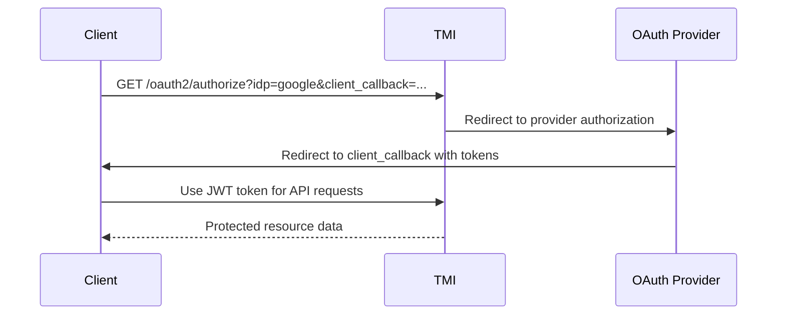

# API Specifications & Reference

This directory contains OpenAPI specifications, API documentation, and integration references for the TMI project.

## Purpose

Complete API reference documentation including OpenAPI specifications, endpoint documentation, authentication guides, and client integration examples for the TMI platform.

## API Categories

### REST API

- **OpenAPI 3.0 Specification**: Complete API specification in OpenAPI format
- **Endpoint Documentation**: Detailed HTTP endpoint reference
- **Authentication**: OAuth and JWT authentication specifications
- **Error Handling**: Standardized error response documentation
- **Request/Response Examples**: Working examples for all endpoints

### WebSocket API

- **Real-time Protocol**: WebSocket message protocol specification
- **Collaboration API**: Multi-user collaboration message formats
- **Connection Management**: WebSocket connection lifecycle documentation
- **Message Types**: Complete message type reference
- **Error Handling**: WebSocket error and recovery procedures

### Authentication API

- **OAuth 2.0 Integration**: OAuth provider integration specifications
- **JWT Token Management**: Token lifecycle and validation
- **Authorization Patterns**: Role-based access control (RBAC)
- **Security Specifications**: Authentication security best practices
- **Client Integration**: OAuth client implementation guidance

## TMI REST API Overview

### Base URL Structure

```
Development: http://localhost:8080
Production:  https://api.tmi.example.com
```

### Authentication

All API requests require JWT authentication via Bearer token:

```http
Authorization: Bearer <jwt_token>
```

### Content Type

All requests and responses use JSON:

```http
Content-Type: application/json
```

## Core API Endpoints

### Authentication Endpoints

```http
# OAuth provider discovery
GET /oauth2/providers

# OAuth authorization (redirects to provider)
GET /oauth2/authorize?idp={provider}&client_callback={url}&login_hint={hint}

# OAuth callback (provider redirects here)
GET /oauth2/callback?code={code}&state={state}

# User profile information
GET /oauth2/me

# Logout (invalidate token)
POST /oauth2/logout
```

### Threat Model Management

```http
# List threat models
GET /threat_models
  ?limit={number}&offset={number}&search={query}

# Create threat model
POST /threat_models
  Body: {"name": "string", "description": "string"}

# Get threat model
GET /threat_models/{id}

# Update threat model
PUT /threat_models/{id}
  Body: {"name": "string", "description": "string"}

# Delete threat model
DELETE /threat_models/{id}

# Get threat model permissions
GET /threat_models/{id}/permissions

# Update permissions
PUT /threat_models/{id}/permissions
  Body: {"user_id": "string", "role": "reader|writer|owner"}
```

### Diagram Management

```http
# List diagrams in threat model
GET /threat_models/{threat_model_id}/diagrams

# Create diagram
POST /threat_models/{threat_model_id}/diagrams
  Body: {"name": "string", "diagram_data": {}}

# Get diagram
GET /threat_models/{threat_model_id}/diagrams/{diagram_id}

# Update diagram
PUT /threat_models/{threat_model_id}/diagrams/{diagram_id}
  Body: {"name": "string", "diagram_data": {}}

# Delete diagram
DELETE /threat_models/{threat_model_id}/diagrams/{diagram_id}
```

### Collaboration Management

```http
# List active collaboration sessions
GET /collaboration/sessions

# Create collaboration session
POST /threat_models/{threat_model_id}/diagrams/{diagram_id}/collaborate

# Join collaboration session
PUT /threat_models/{threat_model_id}/diagrams/{diagram_id}/collaborate

# Get session status
GET /threat_models/{threat_model_id}/diagrams/{diagram_id}/collaborate

# Leave collaboration session
DELETE /threat_models/{threat_model_id}/diagrams/{diagram_id}/collaborate
```

### Threat Management

```http
# List threats in threat model
GET /threat_models/{threat_model_id}/threats

# Create threat
POST /threat_models/{threat_model_id}/threats
  Body: {"title": "string", "description": "string", "severity": "low|medium|high|critical"}

# Get threat
GET /threat_models/{threat_model_id}/threats/{threat_id}

# Update threat
PUT /threat_models/{threat_model_id}/threats/{threat_id}
  Body: {"title": "string", "description": "string", "severity": "string", "status": "open|in_progress|closed"}

# Delete threat
DELETE /threat_models/{threat_model_id}/threats/{threat_id}
```

## WebSocket API Specification

### Connection URL

```
ws://localhost:8080/threat_models/{threat_model_id}/diagrams/{diagram_id}/ws?token={jwt_token}
```

### Message Protocol

#### Outgoing Messages (Client → Server)

```json
// Diagram operation
{
  "message_type": "diagram_operation",
  "user_id": "user@example.com",
  "operation_id": "uuid",
  "operation": {
    "type": "patch",
    "cells": [
      {
        "id": "cell-id",
        "operation": "add|update|remove",
        "data": {} // Cell data for add/update
      }
    ]
  }
}

// Presenter mode request
{
  "message_type": "presenter_request",
  "user_id": "user@example.com"
}

// Cursor position (presenter only)
{
  "message_type": "presenter_cursor",
  "user_id": "user@example.com",
  "cursor_position": {"x": 100, "y": 200}
}

// Selection update (presenter only)
{
  "message_type": "presenter_selection",
  "user_id": "user@example.com",
  "selected_cells": ["cell-id-1", "cell-id-2"]
}

// Undo/Redo requests
{
  "message_type": "undo_request",
  "user_id": "user@example.com"
}

{
  "message_type": "redo_request",
  "user_id": "user@example.com"
}

// Resync request
{
  "message_type": "resync_request",
  "user_id": "user@example.com"
}
```

#### Incoming Messages (Server → Client)

```json
// Diagram operation from other users
{
  "message_type": "diagram_operation",
  "user_id": "other@example.com",
  "operation_id": "uuid",
  "sequence_number": 123,
  "operation": {
    "type": "patch",
    "cells": [...]
  }
}

// Presenter change notification
{
  "message_type": "current_presenter",
  "current_presenter": "presenter@example.com"
}

// Presenter cursor/selection
{
  "message_type": "presenter_cursor",
  "user_id": "presenter@example.com",
  "cursor_position": {"x": 100, "y": 200}
}

// Authorization denied
{
  "message_type": "authorization_denied",
  "original_operation_id": "uuid",
  "reason": "insufficient_permissions"
}

// State correction
{
  "message_type": "state_correction",
  "cells": [
    // Complete corrected cell data
  ]
}

// History operation response
{
  "message_type": "history_operation",
  "operation_type": "undo|redo",
  "message": "resync_required|no_operations_to_undo|no_operations_to_redo"
}

// Session events (legacy format)
{
  "event": "join|leave|session_ended",
  "user_id": "user@example.com",
  "timestamp": "2025-01-01T00:00:00Z",
  "message": "Session ended: host has left" // for session_ended
}
```

## Response Formats

### Success Response

```json
{
  "success": true,
  "data": {
    // Response payload
  },
  "meta": {
    "timestamp": "2025-01-01T00:00:00Z",
    "request_id": "uuid",
    "pagination": {
      "page": 1,
      "limit": 20,
      "total": 100,
      "pages": 5
    } // Optional pagination
  }
}
```

### Error Response

```json
{
  "success": false,
  "data": null,
  "error": {
    "code": "VALIDATION_ERROR",
    "message": "Request validation failed",
    "details": {
      "field": "name",
      "reason": "Field is required"
    }
  },
  "meta": {
    "timestamp": "2025-01-01T00:00:00Z",
    "request_id": "uuid"
  }
}
```

## HTTP Status Codes

### Success Codes

- **200 OK**: Request successful, resource returned
- **201 Created**: Resource created successfully
- **202 Accepted**: Request accepted for processing
- **204 No Content**: Request successful, no response body

### Client Error Codes

- **400 Bad Request**: Invalid request format or parameters
- **401 Unauthorized**: Authentication required or invalid
- **403 Forbidden**: Insufficient permissions for requested operation
- **404 Not Found**: Requested resource does not exist
- **409 Conflict**: Resource conflict (e.g., session already exists)
- **422 Unprocessable Entity**: Request validation failed
- **429 Too Many Requests**: Rate limit exceeded

### Server Error Codes

- **500 Internal Server Error**: Unexpected server error
- **502 Bad Gateway**: Upstream service error
- **503 Service Unavailable**: Service temporarily unavailable
- **504 Gateway Timeout**: Upstream service timeout

## Authentication Flow

### OAuth 2.0 Implicit Flow



### JWT Token Structure

```json
{
  "header": {
    "alg": "HS256",
    "typ": "JWT"
  },
  "payload": {
    "sub": "oauth-provider-specific-id",
    "email": "user@example.com",
    "name": "User Name",
    "locale": "en-US",
    "iss": "https://tmi.example.com",
    "aud": ["https://tmi.example.com"],
    "exp": 1640995200,
    "nbf": 1640991600,
    "iat": 1640991600,
    "jti": "unique-token-id"
  }
}
```

## Rate Limiting

### Rate Limit Headers

```http
X-RateLimit-Limit: 100
X-RateLimit-Remaining: 75
X-RateLimit-Reset: 1640995200
X-RateLimit-Window: 3600
```

### Rate Limit Response (429)

```json
{
  "success": false,
  "error": {
    "code": "RATE_LIMIT_EXCEEDED",
    "message": "Too many requests",
    "details": {
      "limit": 100,
      "window": 3600,
      "reset_at": "2025-01-01T01:00:00Z"
    }
  }
}
```

## OpenAPI Specification

### Specification Location

- **Development**: `http://localhost:8080/openapi.json`
- **Documentation**: `docs/reference/apis/tmi-openapi.json`

### OpenAPI Features

- **Complete API Coverage**: All endpoints documented with examples
- **Schema Validation**: Request/response validation with JSON Schema
- **Authentication Documentation**: OAuth and JWT authentication flows
- **Error Response Documentation**: Complete error response specifications
- **Client Code Generation**: Support for client SDK generation

## Client Integration Examples

### JavaScript/TypeScript

```javascript
// Basic API client setup
const tmiClient = new TMIClient({
  baseUrl: "https://api.tmi.example.com",
  authToken: jwtToken,
});

// List threat models
const threatModels = await tmiClient.threatModels.list({
  limit: 20,
  search: "web application",
});

// Create collaboration session
const session = await tmiClient.collaboration.create(threatModelId, diagramId);

// Connect to WebSocket
const wsClient = new TMIWebSocketClient({
  url: session.websocket_url,
  token: jwtToken,
});

wsClient.on("diagram_operation", (operation) => {
  // Handle remote diagram updates
});
```

### Python

```python
# TMI API client
import requests

class TMIClient:
    def __init__(self, base_url, auth_token):
        self.base_url = base_url
        self.headers = {
            'Authorization': f'Bearer {auth_token}',
            'Content-Type': 'application/json'
        }

    def list_threat_models(self, limit=20, search=None):
        params = {'limit': limit}
        if search:
            params['search'] = search

        response = requests.get(
            f'{self.base_url}/threat_models',
            headers=self.headers,
            params=params
        )
        return response.json()
```

### cURL Examples

```bash
# List threat models
curl -H "Authorization: Bearer $JWT_TOKEN" \
     "https://api.tmi.example.com/threat_models?limit=10"

# Create threat model
curl -X POST \
     -H "Authorization: Bearer $JWT_TOKEN" \
     -H "Content-Type: application/json" \
     -d '{"name":"Web App Threat Model","description":"Security analysis"}' \
     "https://api.tmi.example.com/threat_models"

# Join collaboration session
curl -X PUT \
     -H "Authorization: Bearer $JWT_TOKEN" \
     "https://api.tmi.example.com/threat_models/$TM_ID/diagrams/$DIAG_ID/collaborate"
```

## API Testing

### Postman Collections

- **Complete API Coverage**: All endpoints with examples
- **Environment Variables**: Development and production environments
- **Authentication Setup**: Automated OAuth token management
- **Test Scenarios**: Success and error case testing
- **Collection Running**: Automated test execution

### Integration Testing

- **Database Integration**: Tests with real database
- **Authentication Testing**: OAuth flow validation
- **WebSocket Testing**: Real-time collaboration testing
- **Error Scenario Testing**: Comprehensive error condition testing
- **Performance Testing**: API performance benchmarking

## Related Documentation

### Implementation Guidance

- [Client Integration Guide](../../developer/integration/client-integration-guide.md) - Using these APIs
- [OAuth Integration](../../developer/setup/oauth-integration.md) - Authentication setup

### Testing and Quality

- [API Testing](../../developer/testing/api-integration-tests.md) - API testing procedures
- [Postman Testing](../../developer/testing/postman-comprehensive-testing.md) - Postman collection usage

### Operations and Deployment

- [Deployment Guide](../../operator/deployment/deployment-guide.md) - API deployment
- [Database Schema](../schemas/) - Data structures used by APIs

This API documentation serves as the complete reference for integrating with the TMI platform's REST and WebSocket APIs.
