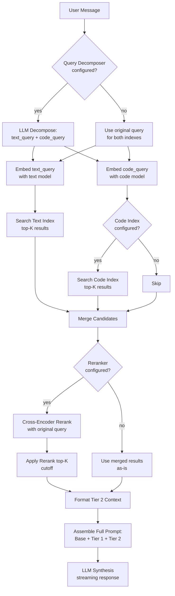

# Query Decomposition and Cross-Encoder Reranking Implementation Plan

> **For agentic workers:** REQUIRED SUB-SKILL: Use superpowers:subagent-driven-development (recommended) or superpowers:executing-plans to implement this plan task-by-task. Steps use checkbox (`- [ ]`) syntax for tracking.

**Goal:** Add optional LLM-driven query decomposition and cross-encoder reranking to Timmy's dual-index search pipeline, with graceful fallback to current behavior when not configured.

**Architecture:** Two new interfaces (`QueryDecomposer`, `Reranker`) with implementations, wired into the existing `buildTier2Context` flow. The session manager gains `searchIndexRaw` (returns raw results instead of formatted text) and the context builder gains `BuildTier2ContextFromResults` (formats pre-searched results). Both features are opt-in via config and nil-safe.

**Tech Stack:** Go, LangChainGo (for decomposer LLM calls), net/http (for reranker API), testify, httptest (mock reranker), SQLite (unit tests)

**Spec:** `docs/superpowers/specs/2026-04-10-query-decomposition-reranking-design.md`

---

### Task 1: Configuration — Add Reranker and Decomposition Config

**Files:**
- Modify: `internal/config/timmy.go`
- Modify: `internal/config/timmy_test.go`

- [ ] **Step 1: Write tests for new config fields**

Add to `internal/config/timmy_test.go`:

```go
func TestTimmyConfig_IsRerankConfigured(t *testing.T) {
	cfg := TimmyConfig{
		RerankProvider: "jina",
		RerankModel:    "jina-reranker-v3",
	}
	assert.True(t, cfg.IsRerankConfigured(), "should be configured with provider + model")

	noModel := TimmyConfig{
		RerankProvider: "jina",
	}
	assert.False(t, noModel.IsRerankConfigured(), "should not be configured without model")

	empty := TimmyConfig{}
	assert.False(t, empty.IsRerankConfigured(), "should not be configured when empty")
}

func TestTimmyConfig_DecompositionAndRerankDefaults(t *testing.T) {
	cfg := DefaultTimmyConfig()
	assert.False(t, cfg.QueryDecompositionEnabled, "decomposition should be off by default")
	assert.Equal(t, 10, cfg.RerankTopK, "rerank top-k should default to 10")
	assert.Empty(t, cfg.RerankProvider)
	assert.Empty(t, cfg.RerankModel)
}
```

- [ ] **Step 2: Run tests to verify they fail**

Run: `make test-unit name=TestTimmyConfig_IsRerankConfigured`
Expected: FAIL — `IsRerankConfigured` not defined

- [ ] **Step 3: Add config fields and method**

In `internal/config/timmy.go`, add after the `CodeRetrievalTopK` field:

```go
	QueryDecompositionEnabled bool   `yaml:"query_decomposition_enabled" env:"TMI_TIMMY_QUERY_DECOMPOSITION_ENABLED"`
	RerankProvider            string `yaml:"rerank_provider" env:"TMI_TIMMY_RERANK_PROVIDER"`
	RerankModel               string `yaml:"rerank_model" env:"TMI_TIMMY_RERANK_MODEL"`
	RerankAPIKey              string `yaml:"rerank_api_key" env:"TMI_TIMMY_RERANK_API_KEY"`
	RerankBaseURL             string `yaml:"rerank_base_url" env:"TMI_TIMMY_RERANK_BASE_URL"`
	RerankTopK                int    `yaml:"rerank_top_k" env:"TMI_TIMMY_RERANK_TOP_K"`
```

In `DefaultTimmyConfig()`, add: `RerankTopK: 10`

Add the new method:

```go
// IsRerankConfigured returns true if the reranker provider and model are configured
func (tc TimmyConfig) IsRerankConfigured() bool {
	return tc.RerankProvider != "" && tc.RerankModel != ""
}
```

- [ ] **Step 4: Run tests**

Run: `make test-unit name=TestTimmyConfig`
Expected: PASS

Run: `make build-server`
Expected: BUILD SUCCESS

- [ ] **Step 5: Commit**

```bash
git add internal/config/timmy.go internal/config/timmy_test.go
git commit -m "feat(timmy): add reranker and query decomposition config"
```

---

### Task 2: Reranker Interface and HTTP Implementation

**Files:**
- Create: `api/timmy_reranker.go`
- Create: `api/timmy_reranker_test.go`

- [ ] **Step 1: Write tests**

Create `api/timmy_reranker_test.go`:

```go
package api

import (
	"context"
	"encoding/json"
	"net/http"
	"net/http/httptest"
	"testing"

	"github.com/stretchr/testify/assert"
	"github.com/stretchr/testify/require"
)

func TestAPIReranker_Rerank(t *testing.T) {
	server := httptest.NewServer(http.HandlerFunc(func(w http.ResponseWriter, r *http.Request) {
		assert.Equal(t, "POST", r.Method)
		assert.Equal(t, "/rerank", r.URL.Path)
		assert.Equal(t, "Bearer test-key", r.Header.Get("Authorization"))

		var req map[string]any
		require.NoError(t, json.NewDecoder(r.Body).Decode(&req))
		assert.Equal(t, "test-model", req["model"])
		assert.Equal(t, "what is authentication?", req["query"])

		docs, ok := req["documents"].([]any)
		require.True(t, ok)
		assert.Len(t, docs, 3)

		w.Header().Set("Content-Type", "application/json")
		json.NewEncoder(w).Encode(map[string]any{
			"results": []map[string]any{
				{"index": 1, "relevance_score": 0.95},
				{"index": 0, "relevance_score": 0.80},
				{"index": 2, "relevance_score": 0.60},
			},
		})
	}))
	defer server.Close()

	reranker := NewAPIReranker(server.URL, "test-model", "test-key", 10, server.Client())

	results, err := reranker.Rerank(context.Background(), "what is authentication?", []string{
		"JWT tokens are used for auth",
		"Authentication uses OAuth 2.0 with PKCE",
		"The database stores user preferences",
	})
	require.NoError(t, err)
	require.Len(t, results, 3)

	// Results should be in descending score order
	assert.Equal(t, 1, results[0].Index)
	assert.InDelta(t, 0.95, results[0].Score, 0.001)
	assert.Equal(t, "Authentication uses OAuth 2.0 with PKCE", results[0].Document)

	assert.Equal(t, 0, results[1].Index)
	assert.InDelta(t, 0.80, results[1].Score, 0.001)

	assert.Equal(t, 2, results[2].Index)
}

func TestAPIReranker_Rerank_TopN(t *testing.T) {
	server := httptest.NewServer(http.HandlerFunc(func(w http.ResponseWriter, r *http.Request) {
		var req map[string]any
		json.NewDecoder(r.Body).Decode(&req)
		// Server should receive top_n from the reranker
		assert.Equal(t, float64(2), req["top_n"])

		w.Header().Set("Content-Type", "application/json")
		json.NewEncoder(w).Encode(map[string]any{
			"results": []map[string]any{
				{"index": 0, "relevance_score": 0.9},
				{"index": 1, "relevance_score": 0.5},
			},
		})
	}))
	defer server.Close()

	reranker := NewAPIReranker(server.URL, "model", "key", 2, server.Client())
	results, err := reranker.Rerank(context.Background(), "query", []string{"doc1", "doc2", "doc3"})
	require.NoError(t, err)
	assert.Len(t, results, 2)
}

func TestAPIReranker_Rerank_HTTPError(t *testing.T) {
	server := httptest.NewServer(http.HandlerFunc(func(w http.ResponseWriter, r *http.Request) {
		w.WriteHeader(http.StatusInternalServerError)
		w.Write([]byte("internal error"))
	}))
	defer server.Close()

	reranker := NewAPIReranker(server.URL, "model", "key", 10, server.Client())
	_, err := reranker.Rerank(context.Background(), "query", []string{"doc1"})
	require.Error(t, err)
	assert.Contains(t, err.Error(), "rerank API returned status 500")
}

func TestAPIReranker_Rerank_EmptyDocuments(t *testing.T) {
	reranker := NewAPIReranker("http://unused", "model", "key", 10, http.DefaultClient)
	results, err := reranker.Rerank(context.Background(), "query", nil)
	require.NoError(t, err)
	assert.Empty(t, results)
}

func TestAPIReranker_Rerank_MalformedJSON(t *testing.T) {
	server := httptest.NewServer(http.HandlerFunc(func(w http.ResponseWriter, r *http.Request) {
		w.Header().Set("Content-Type", "application/json")
		w.Write([]byte(`not json`))
	}))
	defer server.Close()

	reranker := NewAPIReranker(server.URL, "model", "key", 10, server.Client())
	_, err := reranker.Rerank(context.Background(), "query", []string{"doc1"})
	require.Error(t, err)
}
```

- [ ] **Step 2: Run tests to verify they fail**

Run: `make test-unit name=TestAPIReranker`
Expected: FAIL — `NewAPIReranker` not defined

- [ ] **Step 3: Implement reranker**

Create `api/timmy_reranker.go`:

```go
package api

import (
	"bytes"
	"context"
	"encoding/json"
	"fmt"
	"io"
	"net/http"
	"sort"

	"github.com/ericfitz/tmi/internal/slogging"
	"go.opentelemetry.io/otel"
	"go.opentelemetry.io/otel/attribute"
)

// Reranker scores query-document pairs and returns results in relevance order.
type Reranker interface {
	Rerank(ctx context.Context, query string, documents []string) ([]RerankResult, error)
}

// RerankResult represents a single reranked document.
type RerankResult struct {
	Index    int     // original index in the documents slice
	Score    float64 // relevance score (higher = more relevant)
	Document string  // the document text
}

// APIReranker implements Reranker using an HTTP API (Cohere/Jina/vLLM compatible).
type APIReranker struct {
	httpClient *http.Client
	baseURL    string
	model      string
	apiKey     string
	topK       int
}

// NewAPIReranker creates a new API-based reranker.
func NewAPIReranker(baseURL, model, apiKey string, topK int, httpClient *http.Client) *APIReranker {
	return &APIReranker{
		httpClient: httpClient,
		baseURL:    baseURL,
		model:      model,
		apiKey:     apiKey,
		topK:       topK,
	}
}

// Rerank sends documents to the reranker API and returns results sorted by relevance score.
func (r *APIReranker) Rerank(ctx context.Context, query string, documents []string) ([]RerankResult, error) {
	if len(documents) == 0 {
		return nil, nil
	}

	logger := slogging.Get()
	tracer := otel.Tracer("tmi.timmy")
	ctx, span := tracer.Start(ctx, "timmy.rerank",
		attribute.String("tmi.timmy.rerank_model", r.model),
		attribute.Int("tmi.timmy.document_count", len(documents)),
	)
	defer span.End()

	// Build request
	reqBody := map[string]any{
		"model":     r.model,
		"query":     query,
		"documents": documents,
		"top_n":     r.topK,
	}

	bodyBytes, err := json.Marshal(reqBody)
	if err != nil {
		return nil, fmt.Errorf("failed to marshal rerank request: %w", err)
	}

	url := r.baseURL + "/rerank"
	req, err := http.NewRequestWithContext(ctx, http.MethodPost, url, bytes.NewReader(bodyBytes))
	if err != nil {
		return nil, fmt.Errorf("failed to create rerank request: %w", err)
	}
	req.Header.Set("Content-Type", "application/json")
	if r.apiKey != "" {
		req.Header.Set("Authorization", "Bearer "+r.apiKey)
	}

	// Send request
	resp, err := r.httpClient.Do(req)
	if err != nil {
		return nil, fmt.Errorf("rerank request failed: %w", err)
	}
	defer resp.Body.Close()

	if resp.StatusCode != http.StatusOK {
		body, _ := io.ReadAll(resp.Body)
		return nil, fmt.Errorf("rerank API returned status %d: %s", resp.StatusCode, string(body))
	}

	// Parse response
	var respBody struct {
		Results []struct {
			Index          int     `json:"index"`
			RelevanceScore float64 `json:"relevance_score"`
		} `json:"results"`
	}

	if err := json.NewDecoder(resp.Body).Decode(&respBody); err != nil {
		return nil, fmt.Errorf("failed to decode rerank response: %w", err)
	}

	// Build results with original document text
	results := make([]RerankResult, 0, len(respBody.Results))
	for _, r := range respBody.Results {
		if r.Index >= 0 && r.Index < len(documents) {
			results = append(results, RerankResult{
				Index:    r.Index,
				Score:    r.RelevanceScore,
				Document: documents[r.Index],
			})
		}
	}

	// Sort by score descending (API should return sorted, but ensure it)
	sort.Slice(results, func(i, j int) bool {
		return results[i].Score > results[j].Score
	})

	logger.Debug("Reranked %d documents, returning %d results", len(documents), len(results))
	span.SetAttributes(attribute.Int("tmi.timmy.rerank_results", len(results)))

	return results, nil
}
```

- [ ] **Step 4: Run tests**

Run: `make test-unit name=TestAPIReranker`
Expected: PASS

Run: `make build-server`
Expected: BUILD SUCCESS

- [ ] **Step 5: Commit**

```bash
git add api/timmy_reranker.go api/timmy_reranker_test.go
git commit -m "feat(timmy): add Reranker interface and API-based HTTP implementation"
```

---

### Task 3: Query Decomposer Interface and LLM Implementation

**Files:**
- Create: `api/timmy_query_decomposer.go`
- Create: `api/timmy_query_decomposer_test.go`

- [ ] **Step 1: Write tests**

Create `api/timmy_query_decomposer_test.go`:

```go
package api

import (
	"context"
	"testing"

	"github.com/stretchr/testify/assert"
	"github.com/stretchr/testify/require"
)

// mockLLMForDecomposer is a minimal mock that returns a fixed response string.
type mockLLMForDecomposer struct {
	response string
	err      error
}

func (m *mockLLMForDecomposer) GenerateResponse(ctx context.Context, systemPrompt string, userMessage string) (string, error) {
	if m.err != nil {
		return "", m.err
	}
	return m.response, nil
}

func TestLLMQueryDecomposer_ValidDecomposition(t *testing.T) {
	mock := &mockLLMForDecomposer{
		response: `{"text_query": "authentication vulnerabilities threats", "code_query": "login handler auth code", "strategy": "parallel"}`,
	}

	decomposer := &LLMQueryDecomposer{llm: mock}
	result, err := decomposer.Decompose(context.Background(), "What authentication vulnerabilities exist in the login handler code?", true)
	require.NoError(t, err)
	require.NotNil(t, result)
	assert.Equal(t, "authentication vulnerabilities threats", result.TextQuery)
	assert.Equal(t, "login handler auth code", result.CodeQuery)
	assert.Equal(t, "parallel", result.Strategy)
}

func TestLLMQueryDecomposer_NoCodeIndex(t *testing.T) {
	mock := &mockLLMForDecomposer{
		response: `{"text_query": "authentication vulnerabilities", "code_query": "", "strategy": "parallel"}`,
	}

	decomposer := &LLMQueryDecomposer{llm: mock}
	result, err := decomposer.Decompose(context.Background(), "What authentication vulnerabilities exist?", false)
	require.NoError(t, err)
	require.NotNil(t, result)
	assert.Equal(t, "authentication vulnerabilities", result.TextQuery)
	assert.Empty(t, result.CodeQuery)
}

func TestLLMQueryDecomposer_LLMError_FallsBack(t *testing.T) {
	mock := &mockLLMForDecomposer{
		err: assert.AnError,
	}

	decomposer := &LLMQueryDecomposer{llm: mock}
	result, err := decomposer.Decompose(context.Background(), "original question", true)
	require.NoError(t, err, "should not return error — should fall back")
	require.NotNil(t, result)
	assert.Equal(t, "original question", result.TextQuery)
	assert.Equal(t, "original question", result.CodeQuery)
}

func TestLLMQueryDecomposer_UnparseableJSON_FallsBack(t *testing.T) {
	mock := &mockLLMForDecomposer{
		response: "I can't decompose this query, here's my best attempt...",
	}

	decomposer := &LLMQueryDecomposer{llm: mock}
	result, err := decomposer.Decompose(context.Background(), "original question", true)
	require.NoError(t, err)
	require.NotNil(t, result)
	assert.Equal(t, "original question", result.TextQuery)
	assert.Equal(t, "original question", result.CodeQuery)
}

func TestLLMQueryDecomposer_EmptyTextQuery_FallsBackToOriginal(t *testing.T) {
	mock := &mockLLMForDecomposer{
		response: `{"text_query": "", "code_query": "search code", "strategy": "parallel"}`,
	}

	decomposer := &LLMQueryDecomposer{llm: mock}
	result, err := decomposer.Decompose(context.Background(), "original question", true)
	require.NoError(t, err)
	require.NotNil(t, result)
	assert.Equal(t, "original question", result.TextQuery, "empty text_query should fall back to original")
	assert.Equal(t, "search code", result.CodeQuery)
}
```

- [ ] **Step 2: Run tests to verify they fail**

Run: `make test-unit name=TestLLMQueryDecomposer`
Expected: FAIL — `LLMQueryDecomposer` not defined

- [ ] **Step 3: Implement decomposer**

Create `api/timmy_query_decomposer.go`:

```go
package api

import (
	"context"
	"encoding/json"
	"fmt"
	"strings"

	"github.com/ericfitz/tmi/internal/slogging"
	"go.opentelemetry.io/otel"
	"go.opentelemetry.io/otel/attribute"
)

// QueryDecomposer splits a user query into index-specific sub-queries.
type QueryDecomposer interface {
	Decompose(ctx context.Context, query string, hasCodeIndex bool) (*DecomposedQuery, error)
}

// DecomposedQuery holds the sub-queries for each index type.
type DecomposedQuery struct {
	TextQuery string `json:"text_query"` // query optimized for text index
	CodeQuery string `json:"code_query"` // query optimized for code index — empty if no code index
	Strategy  string `json:"strategy"`   // "parallel" or "sequential" (informational)
}

// DecomposerLLM is the interface the decomposer needs from the LLM service.
// This is a narrow interface to enable testing without the full TimmyLLMService.
type DecomposerLLM interface {
	GenerateResponse(ctx context.Context, systemPrompt string, userMessage string) (string, error)
}

// LLMQueryDecomposer uses an inference LLM to decompose user queries.
type LLMQueryDecomposer struct {
	llm DecomposerLLM
}

// NewLLMQueryDecomposer creates a new LLM-based query decomposer.
func NewLLMQueryDecomposer(llm DecomposerLLM) *LLMQueryDecomposer {
	return &LLMQueryDecomposer{llm: llm}
}

const decomposerSystemPrompt = `You are a query decomposition assistant. Given a user question about a threat model, generate optimized sub-queries for searching different indexes.

Text index contains: assets, threats, diagrams, documents, notes
Code index contains: repository source code

Respond with JSON only, no other text:
{"text_query": "...", "code_query": "...", "strategy": "parallel"}

If the question is only about text content, set code_query to empty string.
If the question is only about code, set text_query to empty string.
Use "parallel" strategy unless one query's results are needed to formulate the other.`

const decomposerSystemPromptNoCode = `You are a query decomposition assistant. Given a user question about a threat model, generate an optimized search query for the text index.

Text index contains: assets, threats, diagrams, documents, notes

Respond with JSON only, no other text:
{"text_query": "...", "code_query": "", "strategy": "parallel"}`

// Decompose splits a user query into index-specific sub-queries using the LLM.
// On any error (LLM failure, unparseable output), it falls back to using the
// original query for both indexes.
func (d *LLMQueryDecomposer) Decompose(ctx context.Context, query string, hasCodeIndex bool) (*DecomposedQuery, error) {
	logger := slogging.Get()
	tracer := otel.Tracer("tmi.timmy")
	ctx, span := tracer.Start(ctx, "timmy.query_decompose",
		attribute.Bool("tmi.timmy.has_code_index", hasCodeIndex),
	)
	defer span.End()

	prompt := decomposerSystemPrompt
	if !hasCodeIndex {
		prompt = decomposerSystemPromptNoCode
	}

	response, err := d.llm.GenerateResponse(ctx, prompt, query)
	if err != nil {
		logger.Warn("Query decomposition LLM call failed, using original query: %v", err)
		return fallbackDecomposition(query, hasCodeIndex), nil
	}

	// Parse JSON response — try to extract from markdown code blocks if present
	jsonStr := extractJSON(response)

	var decomposed DecomposedQuery
	if err := json.Unmarshal([]byte(jsonStr), &decomposed); err != nil {
		logger.Warn("Failed to parse query decomposition response, using original query: %v", err)
		return fallbackDecomposition(query, hasCodeIndex), nil
	}

	// Fall back to original query if text_query is empty
	if decomposed.TextQuery == "" {
		decomposed.TextQuery = query
	}

	// Clear code query if no code index
	if !hasCodeIndex {
		decomposed.CodeQuery = ""
	}

	span.SetAttributes(
		attribute.String("tmi.timmy.text_query", decomposed.TextQuery),
		attribute.String("tmi.timmy.code_query", decomposed.CodeQuery),
		attribute.String("tmi.timmy.strategy", decomposed.Strategy),
	)

	logger.Debug("Decomposed query: text=%q code=%q strategy=%s", decomposed.TextQuery, decomposed.CodeQuery, decomposed.Strategy)
	return &decomposed, nil
}

// fallbackDecomposition returns the original query for both indexes.
func fallbackDecomposition(query string, hasCodeIndex bool) *DecomposedQuery {
	codeQuery := ""
	if hasCodeIndex {
		codeQuery = query
	}
	return &DecomposedQuery{
		TextQuery: query,
		CodeQuery: codeQuery,
		Strategy:  "parallel",
	}
}

// extractJSON tries to extract a JSON object from a string that might contain
// markdown code blocks or surrounding text.
func extractJSON(s string) string {
	s = strings.TrimSpace(s)

	// Try to extract from ```json ... ``` blocks
	if idx := strings.Index(s, "```json"); idx >= 0 {
		start := idx + 7
		if end := strings.Index(s[start:], "```"); end >= 0 {
			return strings.TrimSpace(s[start : start+end])
		}
	}
	if idx := strings.Index(s, "```"); idx >= 0 {
		start := idx + 3
		if end := strings.Index(s[start:], "```"); end >= 0 {
			candidate := strings.TrimSpace(s[start : start+end])
			if len(candidate) > 0 && candidate[0] == '{' {
				return candidate
			}
		}
	}

	// Try to find a JSON object directly
	if start := strings.Index(s, "{"); start >= 0 {
		if end := strings.LastIndex(s, "}"); end > start {
			return s[start : end+1]
		}
	}

	return s
}
```

- [ ] **Step 4: Add GenerateResponse to TimmyLLMService**

The decomposer needs a simple `GenerateResponse(ctx, systemPrompt, userMessage) (string, error)` method. Add to `api/timmy_llm_service.go`:

```go
// GenerateResponse sends a single-turn chat request and returns the full response text.
// This is a convenience wrapper for non-streaming use cases like query decomposition.
func (s *TimmyLLMService) GenerateResponse(ctx context.Context, systemPrompt string, userMessage string) (string, error) {
	messages := []llms.MessageContent{
		llms.TextParts(llms.ChatMessageTypeHuman, userMessage),
	}
	response, _, err := s.GenerateStreamingResponse(ctx, systemPrompt, messages, nil)
	return response, err
}
```

This makes `TimmyLLMService` satisfy the `DecomposerLLM` interface.

- [ ] **Step 5: Run tests**

Run: `make test-unit name=TestLLMQueryDecomposer`
Expected: PASS

Run: `make build-server`
Expected: BUILD SUCCESS

- [ ] **Step 6: Commit**

```bash
git add api/timmy_query_decomposer.go api/timmy_query_decomposer_test.go api/timmy_llm_service.go
git commit -m "feat(timmy): add QueryDecomposer interface and LLM-based implementation"
```

---

### Task 4: ContextBuilder — Add BuildTier2ContextFromResults

**Files:**
- Modify: `api/timmy_context_builder.go`
- Modify: `api/timmy_context_builder_test.go`

- [ ] **Step 1: Write tests**

Add to `api/timmy_context_builder_test.go`:

```go
func TestContextBuilder_BuildTier2ContextFromResults(t *testing.T) {
	cb := NewContextBuilder()

	results := []VectorSearchResult{
		{ID: "chunk-1", ChunkText: "Authentication uses JWT tokens.", Similarity: 0.95},
		{ID: "chunk-2", ChunkText: "Database uses AES-256 encryption.", Similarity: 0.80},
	}

	output := cb.BuildTier2ContextFromResults(results)
	assert.Contains(t, output, "JWT tokens")
	assert.Contains(t, output, "AES-256")
	assert.Contains(t, output, "Source 1")
	assert.Contains(t, output, "Source 2")
	assert.Contains(t, output, "0.95")
	assert.Contains(t, output, "0.80")
}

func TestContextBuilder_BuildTier2ContextFromResults_Empty(t *testing.T) {
	cb := NewContextBuilder()
	assert.Equal(t, "", cb.BuildTier2ContextFromResults(nil))
	assert.Equal(t, "", cb.BuildTier2ContextFromResults([]VectorSearchResult{}))
}
```

- [ ] **Step 2: Run tests to verify they fail**

Run: `make test-unit name=TestContextBuilder_BuildTier2ContextFromResults`
Expected: FAIL — method not defined

- [ ] **Step 3: Implement**

Add to `api/timmy_context_builder.go`:

```go
// BuildTier2ContextFromResults formats pre-searched (and optionally reranked) vector search results
// into tier 2 context for the LLM prompt.
func (cb *ContextBuilder) BuildTier2ContextFromResults(results []VectorSearchResult) string {
	if len(results) == 0 {
		return ""
	}

	var sb strings.Builder
	sb.WriteString("## Relevant Source Material\n\n")
	for i, r := range results {
		fmt.Fprintf(&sb, "### Source %d (relevance: %.2f)\n", i+1, r.Similarity)
		sb.WriteString(r.ChunkText)
		sb.WriteString("\n\n")
	}

	return sb.String()
}
```

- [ ] **Step 4: Run tests**

Run: `make test-unit name=TestContextBuilder`
Expected: PASS (all existing + new tests)

- [ ] **Step 5: Commit**

```bash
git add api/timmy_context_builder.go api/timmy_context_builder_test.go
git commit -m "feat(timmy): add BuildTier2ContextFromResults to ContextBuilder"
```

---

### Task 5: Session Manager — Wire Decomposer and Reranker into Pipeline

**Files:**
- Modify: `api/timmy_session_manager.go`
- Modify: `api/timmy_session_manager_test.go`

- [ ] **Step 1: Write tests**

Add to `api/timmy_session_manager_test.go`:

```go
func TestTimmySessionManager_NilDecomposerUsesOriginalQuery(t *testing.T) {
	sm := &TimmySessionManager{
		config:         config.DefaultTimmyConfig(),
		contextBuilder: NewContextBuilder(),
		// decomposer is nil — should use original query
		// reranker is nil — should not rerank
	}

	// With nil llmService and vectorManager, buildTier2Context returns ""
	// This test verifies the method doesn't panic with nil decomposer/reranker
	result := sm.buildTier2Context(context.Background(), "tm-001", "test query")
	assert.Equal(t, "", result, "should return empty with nil LLM service")
}

func TestTimmySessionManager_SearchIndexRaw_NilService(t *testing.T) {
	sm := &TimmySessionManager{
		config:         config.DefaultTimmyConfig(),
		contextBuilder: NewContextBuilder(),
	}

	results := sm.searchIndexRaw(context.Background(), "tm-001", IndexTypeText, "query", 10)
	assert.Empty(t, results, "should return nil with nil LLM service")
}
```

- [ ] **Step 2: Add decomposer and reranker fields to TimmySessionManager**

In `api/timmy_session_manager.go`, add to the struct:

```go
type TimmySessionManager struct {
	config           config.TimmyConfig
	llmService       *TimmyLLMService
	vectorManager    *VectorIndexManager
	providerRegistry *ContentProviderRegistry
	chunker          *TextChunker
	contextBuilder   *ContextBuilder
	rateLimiter      *TimmyRateLimiter
	reranker         Reranker        // nil if not configured
	decomposer       QueryDecomposer // nil if not enabled
}
```

Update `NewTimmySessionManager` to accept and store them:

```go
func NewTimmySessionManager(
	cfg config.TimmyConfig,
	llm *TimmyLLMService,
	vm *VectorIndexManager,
	registry *ContentProviderRegistry,
	rl *TimmyRateLimiter,
	reranker Reranker,
	decomposer QueryDecomposer,
) *TimmySessionManager {
	return &TimmySessionManager{
		config:           cfg,
		llmService:       llm,
		vectorManager:    vm,
		providerRegistry: registry,
		chunker:          NewTextChunker(cfg.ChunkSize, cfg.ChunkOverlap),
		contextBuilder:   NewContextBuilder(),
		rateLimiter:      rl,
		reranker:         reranker,
		decomposer:       decomposer,
	}
}
```

- [ ] **Step 3: Add searchIndexRaw method**

Add to `api/timmy_session_manager.go`:

```go
// searchIndexRaw embeds the query and performs vector search, returning raw results
func (sm *TimmySessionManager) searchIndexRaw(ctx context.Context, threatModelID, indexType, query string, topK int) []VectorSearchResult {
	if sm.llmService == nil || sm.vectorManager == nil {
		return nil
	}

	logger := slogging.Get()

	vectors, err := sm.llmService.EmbedTexts(ctx, []string{query}, indexType)
	if err != nil {
		logger.Warn("Failed to embed query for %s vector search: %v", indexType, err)
		return nil
	}
	if len(vectors) == 0 {
		return nil
	}

	dim := len(vectors[0])
	idx, err := sm.vectorManager.GetOrLoadIndex(ctx, threatModelID, indexType, dim)
	if err != nil {
		logger.Warn("Failed to get %s vector index for search: %v", indexType, err)
		return nil
	}
	defer sm.vectorManager.ReleaseIndex(threatModelID, indexType)

	return idx.Search(vectors[0], topK)
}
```

- [ ] **Step 4: Rewrite buildTier2Context to use the full pipeline**

Replace the existing `buildTier2Context` method:

```go
// buildTier2Context runs the full query pipeline: decompose → search → rerank → format
func (sm *TimmySessionManager) buildTier2Context(ctx context.Context, threatModelID, query string) string {
	if sm.llmService == nil || sm.vectorManager == nil {
		return ""
	}

	logger := slogging.Get()

	// Step 1: Query decomposition (optional)
	textQuery := query
	codeQuery := query
	if sm.decomposer != nil {
		decomposed, err := sm.decomposer.Decompose(ctx, query, sm.config.IsCodeIndexConfigured())
		if err != nil {
			logger.Warn("Query decomposition failed, using original query: %v", err)
		} else {
			textQuery = decomposed.TextQuery
			if textQuery == "" {
				textQuery = query
			}
			codeQuery = decomposed.CodeQuery
			if codeQuery == "" {
				codeQuery = query
			}
		}
	}

	// Step 2: Search both indexes
	var allResults []VectorSearchResult

	textResults := sm.searchIndexRaw(ctx, threatModelID, IndexTypeText, textQuery, sm.config.TextRetrievalTopK)
	allResults = append(allResults, textResults...)

	if sm.config.IsCodeIndexConfigured() {
		codeResults := sm.searchIndexRaw(ctx, threatModelID, IndexTypeCode, codeQuery, sm.config.CodeRetrievalTopK)
		allResults = append(allResults, codeResults...)
	}

	if len(allResults) == 0 {
		return ""
	}

	// Step 3: Reranking (optional)
	if sm.reranker != nil {
		documents := make([]string, len(allResults))
		for i, r := range allResults {
			documents[i] = r.ChunkText
		}

		reranked, err := sm.reranker.Rerank(ctx, query, documents)
		if err != nil {
			logger.Warn("Reranking failed, using unranked results: %v", err)
		} else {
			// Convert reranked results back to VectorSearchResult
			rerankedResults := make([]VectorSearchResult, len(reranked))
			for i, rr := range reranked {
				rerankedResults[i] = VectorSearchResult{
					ID:         allResults[rr.Index].ID,
					ChunkText:  rr.Document,
					Similarity: float32(rr.Score),
				}
			}
			allResults = rerankedResults
		}
	}

	// Step 4: Format results
	return sm.contextBuilder.BuildTier2ContextFromResults(allResults)
}
```

- [ ] **Step 5: Remove old searchIndex method**

Delete the old `searchIndex` method (the one that returned a formatted string). It's no longer used — `searchIndexRaw` replaces it.

- [ ] **Step 6: Update all callers of NewTimmySessionManager**

The constructor now takes two additional parameters (`reranker`, `decomposer`). Update:

In `cmd/server/main.go`, update the `NewTimmySessionManager` call. Before the call, create the reranker and decomposer:

```go
	// Create reranker if configured
	var reranker api.Reranker
	if cfg.Timmy.IsRerankConfigured() {
		reranker = api.NewAPIReranker(
			cfg.Timmy.RerankBaseURL, cfg.Timmy.RerankModel,
			cfg.Timmy.RerankAPIKey, cfg.Timmy.RerankTopK, httpClient,
		)
		logger.Info("Timmy reranker configured (model=%s)", cfg.Timmy.RerankModel)
	}

	// Create query decomposer if enabled
	var decomposer api.QueryDecomposer
	if cfg.Timmy.QueryDecompositionEnabled && llmService != nil {
		decomposer = api.NewLLMQueryDecomposer(llmService)
		logger.Info("Timmy query decomposition enabled")
	}

	sessionManager := api.NewTimmySessionManager(
		cfg.Timmy, llmService, vectorManager, registry, rateLimiter,
		reranker, decomposer,
	)
```

Note: The `httpClient` variable may need to be extracted from the LLM service creation block or created separately. Check the existing code in `main.go` for how the HTTP client is created.

In `api/timmy_session_manager_test.go`, update `setupSessionManagerTest` to pass `nil, nil` for the two new params:

```go
sm := NewTimmySessionManager(cfg, nil, nil, nil, NewTimmyRateLimiter(...), nil, nil)
```

Search for ALL other calls to `NewTimmySessionManager` in test files and update them.

- [ ] **Step 7: Run tests**

Run: `make test-unit name=TestTimmySessionManager`
Expected: PASS

Run: `make build-server`
Expected: BUILD SUCCESS

Run: `make test-unit`
Expected: ALL PASS

- [ ] **Step 8: Commit**

```bash
git add api/timmy_session_manager.go api/timmy_session_manager_test.go cmd/server/main.go
git commit -m "feat(timmy): wire query decomposition and reranking into search pipeline"
```

---

### Task 6: Integration Tests

**Files:**
- Create: `test/integration/workflows/timmy_query_pipeline_test.go`

- [ ] **Step 1: Write integration tests**

Create `test/integration/workflows/timmy_query_pipeline_test.go`:

```go
package workflows

import (
	"context"
	"os"
	"testing"

	"github.com/ericfitz/tmi/api"
	"github.com/stretchr/testify/assert"
	"github.com/stretchr/testify/require"
	"net/http"
	"time"
)

// TestRerankerIntegration tests the reranker against a live API endpoint.
// Gated by TMI_TEST_RERANK_BASE_URL.
func TestRerankerIntegration(t *testing.T) {
	baseURL := os.Getenv("TMI_TEST_RERANK_BASE_URL")
	if baseURL == "" {
		t.Skip("Skipping reranker integration test (set TMI_TEST_RERANK_BASE_URL)")
	}
	model := os.Getenv("TMI_TEST_RERANK_MODEL")
	if model == "" {
		model = "jinaai/jina-reranker-v3-mlx"
	}
	apiKey := os.Getenv("TMI_TEST_RERANK_API_KEY")

	httpClient := &http.Client{Timeout: 30 * time.Second}
	reranker := api.NewAPIReranker(baseURL, model, apiKey, 3, httpClient)

	documents := []string{
		"The authentication system uses OAuth 2.0 with PKCE for browser-based clients.",
		"User preferences are stored in a PostgreSQL database with row-level security.",
		"The login handler validates credentials against bcrypt-hashed passwords.",
		"API rate limiting uses a sliding window algorithm with Redis backing.",
		"Session tokens are JWT with 1-hour expiry and refresh token rotation.",
	}

	results, err := reranker.Rerank(context.Background(), "How does authentication work?", documents)
	require.NoError(t, err)
	require.NotEmpty(t, results)

	// Results should be sorted by relevance score descending
	for i := 1; i < len(results); i++ {
		assert.GreaterOrEqual(t, results[i-1].Score, results[i].Score,
			"results should be sorted by descending score")
	}

	// The most relevant document should be about authentication, not rate limiting or preferences
	t.Logf("Top result (score=%.3f): %s", results[0].Score, results[0].Document)
	assert.Contains(t, results[0].Document, "auth",
		"top result should be about authentication")
}

// TestDecomposerIntegration tests query decomposition against a live LLM.
// Gated by TMI_TEST_DECOMPOSITION_BASE_URL.
func TestDecomposerIntegration(t *testing.T) {
	baseURL := os.Getenv("TMI_TEST_DECOMPOSITION_BASE_URL")
	if baseURL == "" {
		t.Skip("Skipping decomposer integration test (set TMI_TEST_DECOMPOSITION_BASE_URL)")
	}

	// This test needs a real LLM service configured. Since we can't easily
	// create a TimmyLLMService without full config, we test the decomposer
	// with a simple HTTP-based mock LLM that wraps the actual endpoint.
	// For now, skip if no decomposition model is configured.
	t.Skip("Decomposer integration test requires full LLM service setup — run via make test-integration")
}
```

- [ ] **Step 2: Run to verify tests skip gracefully**

Run: `make test-unit name=TestRerankerIntegration`
Expected: SKIP — "Skipping reranker integration test"

- [ ] **Step 3: Commit**

```bash
git add test/integration/workflows/timmy_query_pipeline_test.go
git commit -m "test(timmy): add reranker and decomposer integration tests"
```

---

### Task 7: Wiki Updates and Architecture Diagram

**Files:**
- Modify: `/Users/efitz/Projects/tmi.wiki/Configuration-Reference.md`
- Modify: `/Users/efitz/Projects/tmi.wiki/Timmy-AI-Assistant.md`

- [ ] **Step 1: Update Configuration-Reference.md**

Add to the Timmy AI Assistant section, after the "Chunking Configuration" subsection:

**Query Decomposition subsection:**

```markdown
#### Query Decomposition (Optional)

| Variable | Default | Description |
|----------|---------|-------------|
| `TMI_TIMMY_QUERY_DECOMPOSITION_ENABLED` | false | Enable LLM-driven query decomposition for dual-index search |

When enabled, Timmy uses the inference LLM to split user queries into index-specific sub-queries before searching. This can improve retrieval quality for mixed questions that span text content and code repositories, at the cost of an additional LLM call per message.
```

**Cross-Encoder Reranking subsection:**

```markdown
#### Cross-Encoder Reranking (Optional)

Reranking uses a cross-encoder model to rescore search results after retrieval, improving precision by selecting the most relevant chunks for the LLM context.

| Variable | Default | Description |
|----------|---------|-------------|
| `TMI_TIMMY_RERANK_PROVIDER` | _(none)_ | Reranker provider name |
| `TMI_TIMMY_RERANK_MODEL` | _(none)_ | Reranker model name (e.g., `jinaai/jina-reranker-v3-mlx`) |
| `TMI_TIMMY_RERANK_API_KEY` | _(none)_ | Reranker API key |
| `TMI_TIMMY_RERANK_BASE_URL` | _(none)_ | Reranker API base URL (include version prefix, e.g., `http://localhost:1234/v1`) |
| `TMI_TIMMY_RERANK_TOP_K` | 10 | Number of results to keep after reranking |
```

Add reranker fields to the YAML example block.

Add reranker to the "Minimum Configuration" example:

```bash
# Optional: enable cross-encoder reranking
TMI_TIMMY_RERANK_PROVIDER=jina
TMI_TIMMY_RERANK_MODEL=jinaai/jina-reranker-v3-mlx
TMI_TIMMY_RERANK_BASE_URL=http://localhost:1234/v1

# Optional: enable query decomposition
TMI_TIMMY_QUERY_DECOMPOSITION_ENABLED=true
```

- [ ] **Step 2: Update Timmy-AI-Assistant.md — Architecture Decisions**

Update the Architecture Decisions section to add:

```markdown
7. **Query pipeline:** Optional two-stage enhancement — LLM-driven query decomposition splits user questions into index-specific sub-queries (off by default), and cross-encoder reranking rescores merged results for higher precision (requires separate reranker model). Both degrade gracefully when not configured.
```

- [ ] **Step 3: Add Mermaid architecture diagram**

Add to Timmy-AI-Assistant.md, in a new "Query Pipeline Architecture" section after Architecture Decisions:

````markdown
### Query Pipeline Architecture


````

- [ ] **Step 4: Update In Progress section**

Remove #241 from "In Progress" and move it to "Completed" in the implementation status section.

- [ ] **Step 5: Commit and push wiki**

```bash
cd /Users/efitz/Projects/tmi.wiki
git add Configuration-Reference.md Timmy-AI-Assistant.md
git commit -m "docs: add query decomposition and reranking config, pipeline diagram"
git push
```

- [ ] **Step 6: Commit the plan file in the main repo**

```bash
cd /Users/efitz/Projects/tmi
git add -f docs/superpowers/plans/2026-04-10-query-decomposition-reranking.md
git commit -m "docs(timmy): add query decomposition and reranking implementation plan"
```

---

### Task 8: Full Test Suite, Lint, and Push

- [ ] **Step 1: Run lint**

Run: `make lint`
Expected: 0 new issues

- [ ] **Step 2: Run full unit test suite**

Run: `make test-unit`
Expected: PASS

- [ ] **Step 3: Build server**

Run: `make build-server`
Expected: BUILD SUCCESS

- [ ] **Step 4: Fix any failures and commit fixes**

- [ ] **Step 5: Review commit history**

Run: `git log --oneline HEAD~10..HEAD`

- [ ] **Step 6: Push**

```bash
git pull --rebase
git push
git status
```

Expected: "up to date with origin"
