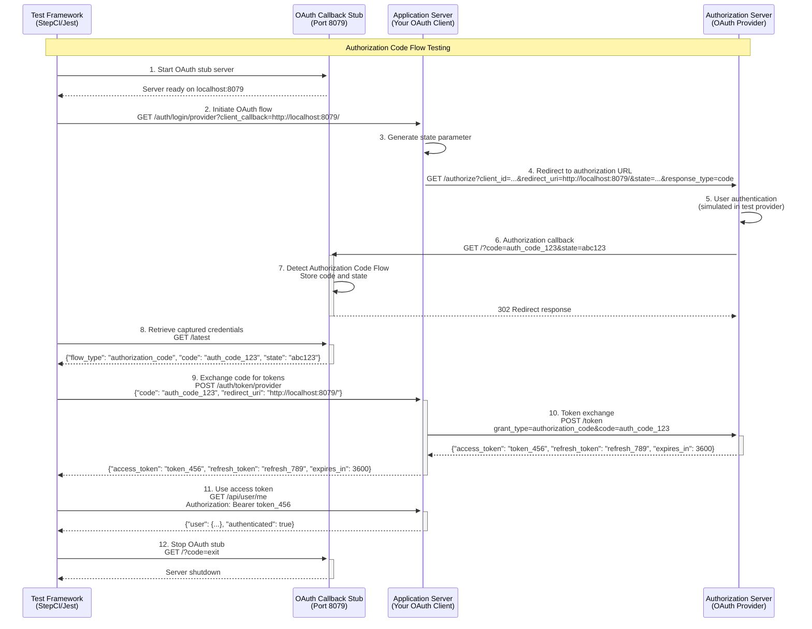
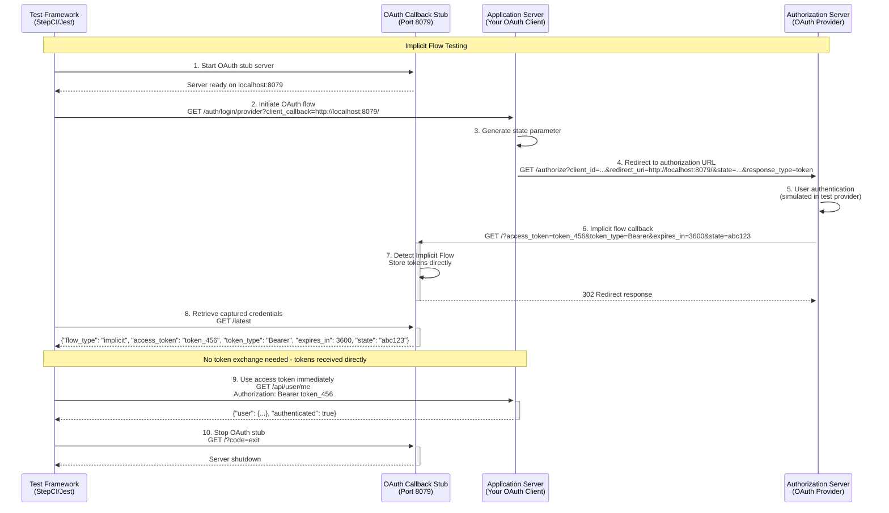
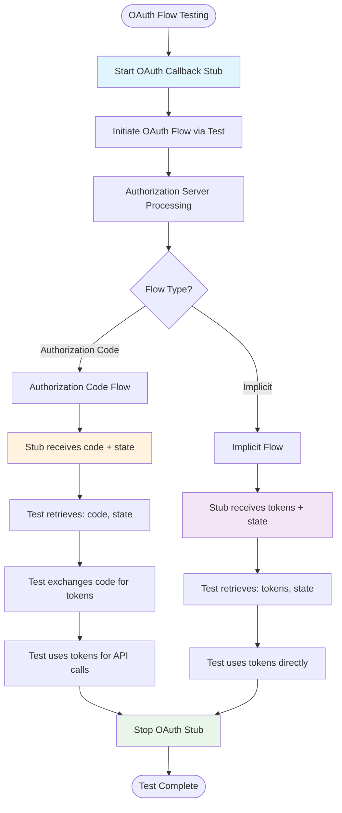

# OAuth 2.0 Flow Diagrams with Stub Tool Integration

This document shows how the OAuth Client Callback Stub integrates with OAuth 2.0 flows during testing scenarios.

## Authorization Code Flow with OAuth Stub

## Implicit Flow with OAuth Stub

## Flow Comparison Summary

## Key Integration Points

### OAuth Stub Tool Responsibilities

1. **Server Management**
   - Start HTTP server on configurable port (default 8079)
   - Provide callback endpoint for OAuth redirects
   - Offer credentials API for test consumption

2. **Flow Detection**
   - Automatically detect Authorization Code vs Implicit flow
   - Parse and store appropriate parameters
   - Return flow-specific JSON responses

3. **Test Integration**
   - Solve StepCI variable substitution limitations
   - Provide reliable credential retrieval mechanism
   - Enable graceful shutdown via HTTP request

### Test Framework Integration

1. **Setup Phase**
   - Start OAuth stub server
   - Configure application with stub callback URL
   - Clear any existing credentials

2. **Execution Phase**
   - Trigger OAuth flow through application
   - Wait for callback to be captured
   - Retrieve credentials from stub API

3. **Verification Phase**
   - Use captured credentials appropriately per flow type
   - Test API endpoints with obtained tokens
   - Validate expected behavior

4. **Cleanup Phase**
   - Stop OAuth stub server
   - Clean up test data

### Flow-Specific Differences

| Aspect | Authorization Code Flow | Implicit Flow |
|--------|------------------------|---------------|
| **Callback Parameters** | `code`, `state` | `access_token`, `token_type`, `expires_in`, `state` |
| **Additional Steps** | Code exchange required | Direct token usage |
| **Security** | More secure (server-side exchange) | Less secure (client-side tokens) |
| **Test Complexity** | Higher (2-step process) | Lower (direct token usage) |
| **Stub Response** | `{"flow_type": "authorization_code", "code": "...", "state": "..."}` | `{"flow_type": "implicit", "access_token": "...", "token_type": "...", "expires_in": ..., "state": "..."}` |

## Usage in Different Test Scenarios

### Unit Testing
- Mock OAuth stub responses
- Test flow detection logic
- Validate credential parsing

### Integration Testing
- Real OAuth stub server
- Full flow execution
- End-to-end credential handling

### API Testing
- Use captured tokens for authenticated requests
- Test token refresh flows (Authorization Code only)
- Validate token expiration handling

### Load Testing
- Multiple concurrent OAuth flows
- Stub server performance under load
- Token usage rate limiting